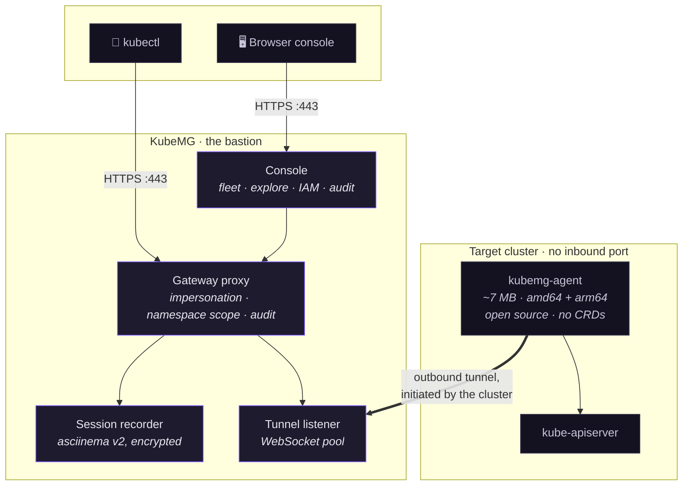
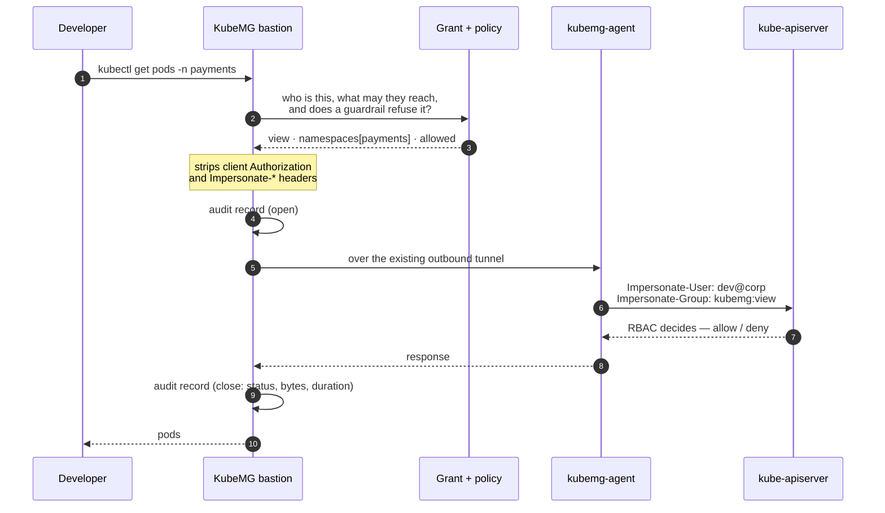
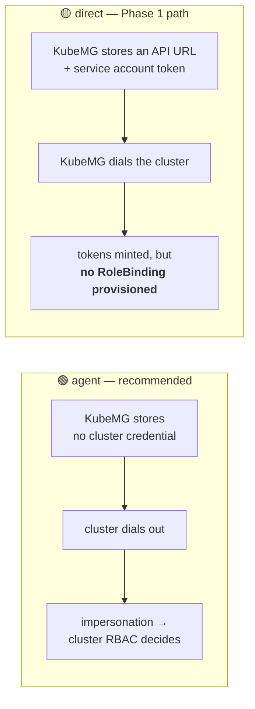
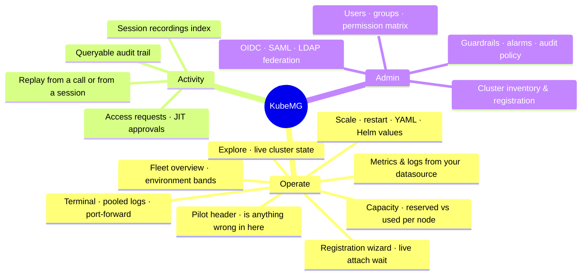
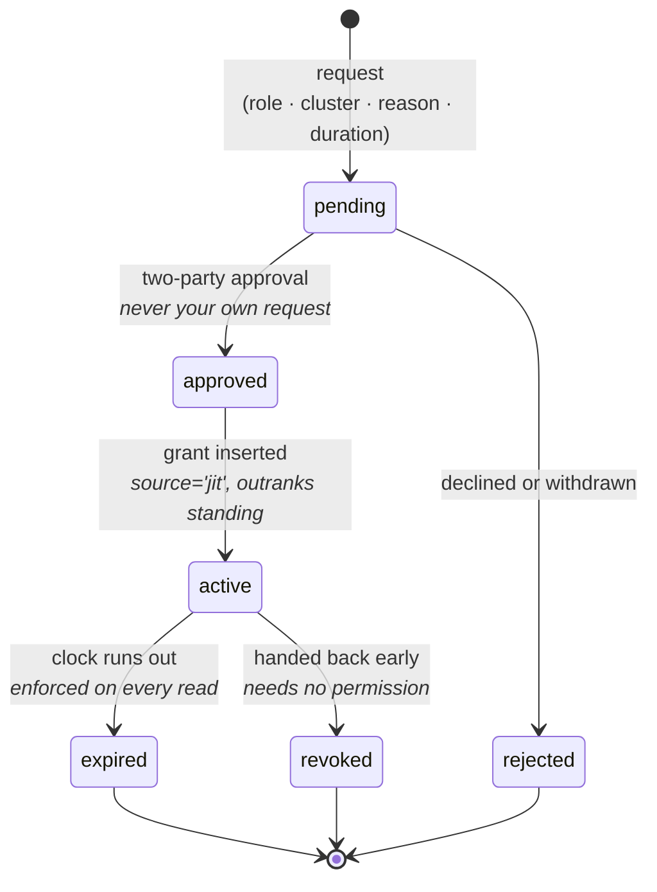
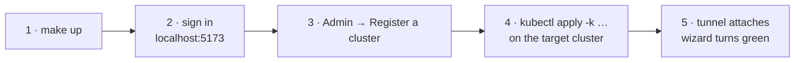
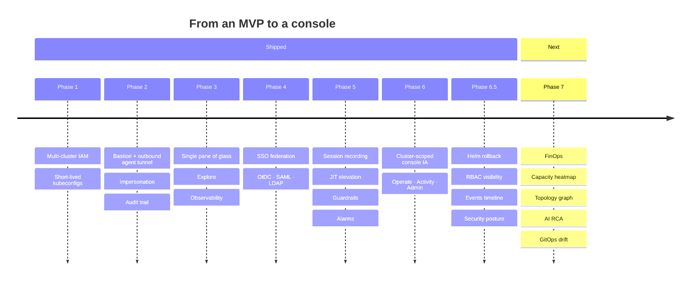

<div align="center">

# KubeMG

**Centralized, audited access to every Kubernetes cluster — without opening one firewall port.**

A lighter alternative to Rancher, Lens or the Kubernetes Dashboard, built around one idea:
**nobody needs network access to a cluster's API server to work with it.**

[](backend/)
[](frontend/)
[](agent/)
[](LICENSE)
[](backend/pkg/db/)
[](Makefile)

</div>

---

Developers reach clusters through KubeMG. KubeMG reaches clusters through an outbound tunnel a
small in-cluster agent opens to it. Every call in between is made under the caller's own
impersonated identity, and every call is audited — including the interactive ones, which are
recorded and replayable.



No inbound firewall rule on the cluster. No heavy in-cluster controller. In agent mode KubeMG
stores **no cluster credential at all** — only the registration token the agent presents when it
dials in.

## Why

| The problem | What KubeMG does |
|---|---|
| **Heavy agents.** Rancher-class platforms install controllers and dozens of CRDs, then want to own the cluster. | Installs a tunnel and nothing else — one Deployment, one Secret, one ServiceAccount. |
| **Desktop tools don't manage teams.** Lens is per-laptop; there is no central place to say who may reach production. | Users, groups, effective-permission merging, and a fleet-wide permission matrix. |
| **Handing out access is an operational wound.** Long-lived kubeconfigs get copied, shared, never revoked. | Short-lived scoped kubeconfigs that point at KubeMG, so revoking access actually revokes it. |
| **"Who ran that in prod?"** has no answer. | Every call audited, refusals included; every shell recorded and replayable. |
| **Standing admin access** because someone needs it twice a quarter. | Just-in-time elevation: a role, a cluster, a mandatory reason and a clock. |
| **Nothing stops `kubectl delete ns prod`** typed at 03:00 by exactly the person allowed to run it. | Guardrails that refuse on KubeMG's own authority — including line-by-line inside an interactive shell, which the cluster's own audit cannot see at all. |
| **A pod list is a list.** Whether anything is wrong in it is read out of a hundred rows by eye. | Explore's pilot header: state, failures and the cluster's own reason, above the table and derived from rows already loaded. |

## How a request flows

Every read the console does takes the same path a `kubectl` call does. The UI gets no privileged
shortcut — that is the whole design.



The two things worth noticing: the **cluster's own RBAC** makes the authorization decision, and a
refusal is audited just as loudly as a success.

## Security model

The parts worth reading before trusting it with production.

<table>
<tr><th align="left">Control</th><th align="left">What it actually means</th></tr>
<tr><td><b>Impersonation, not shared service accounts</b></td>
<td>The proxy calls the API server with <code>Impersonate-User</code>/<code>Impersonate-Group</code> derived from the caller's grant. A <code>view</code> grant is read-only because the cluster says so, not because KubeMG remembered to check. Client-supplied impersonation and <code>Authorization</code> headers are stripped.</td></tr>
<tr><td><b>Namespace scope enforced in the proxy</b></td>
<td>A KubeMG concept impersonation groups cannot express, so it is enforced locally: a scoped grant is refused on anything reaching past it, cluster-wide lists included.</td></tr>
<tr><td><b>Command guardrails — the one refusal KubeMG makes on its own authority</b></td>
<td>Every other check resolves <i>who</i> the caller is; the substantive "may they" is the cluster's. A guardrail is deliberately not that — it stops calls the caller is fully entitled to make, because <code>kubectl delete ns prod</code> succeeds <i>precisely</i> for the person privileged to run it, and RBAC cannot express "an admin may do this, but not by typing it into a terminal at 03:00". Rules are global or per-cluster, <code>block</code> or <code>warn</code>, and enforcement sits in <b>three</b> places because a destructive act arrives in three shapes: the proxied call, the argv of a non-interactive <code>exec</code>, and a <b>line editor over the stdin of an interactive shell</b> — the half nothing cluster-side can see, since a shell is one already-allowed API call and everything typed inside it is invisible to the cluster's own audit.</td></tr>
<tr><td><b>Everything audited, refusals included</b></td>
<td>A long-lived call (<code>exec</code>, <code>attach</code>, <code>watch</code>, <code>logs -f</code>, <code>port-forward</code>) is recorded twice — at open and at close — so an hour-long session is visible while it is still running. Verbs are named after the subresource: a shell in a production pod reads as <code>exec</code>, never as a <code>get</code>.</td></tr>
<tr><td><b>Sessions recorded and replayable</b></td>
<td>Every <code>exec</code>/<code>attach</code> is teed into a gzipped <a href="https://asciinema.org">asciinema</a> v2 cast, replayed from the audit row it belongs to or from the Recordings index — which lists sessions rather than calls, and shows which shells are open right now.</td></tr>
<tr><td><b>Recordings are the most sensitive artefact here</b></td>
<td>Encrypted at rest (chunked AES-256-GCM, so a trimmed or altered file fails to authenticate rather than replaying short). Keystroke capture is switchable off where operators type credentials. <b>Watching one is itself audited.</b> Reaching somebody else's needs a capability separate from the admin role, grantable only by a super admin. Everyone may always replay their own.</td></tr>
<tr><td><b>Disclosure before the first keystroke</b></td>
<td>The in-browser terminal states what is captured, whether keystrokes are included, whether it is encrypted and how long it is kept — as a persistent line, not a dialog that gets dismissed by reflex.</td></tr>
<tr><td><b>Scoped kubeconfig tokens</b></td>
<td>A kubeconfig lives on a laptop, so the token inside one is minted for exactly one cluster's proxy route and is not a session key for the rest of the API. Revocation works because every proxied call re-reads the user and the grant.</td></tr>
<tr><td><b>The bastion terminates its own TLS</b></td>
<td>Mints a self-signed certificate on first boot when none is configured, and pins it into every rendered agent package. Not decoration: client-go refuses to send a bearer token over plain HTTP, so <code>kubectl exec</code> through the gateway requires TLS.</td></tr>
<tr><td><b>Reads never widen a grant</b></td>
<td>Resource, metrics and Helm reads all go down the same impersonated, audited tunnel. Secret and ConfigMap listings return <b>keys only</b> — no value enters a response.</td></tr>
</table>

### Two connection modes



The direct-mode limitation is **deliberate and disclosed in the UI**: a generated kubeconfig there
authenticates without authorizing, and the permission matrix governs KubeMG's own authorization
rather than the cluster's. Agent mode is where the RBAC story closes.

## What it does

The console splits on **the job being done, not on how KubeMG is built** — the cluster you are in
and the fleet it belongs to; what has been happening; and everything administrative. Operate and
Activity are open to everyone and every row in them resolves for everyone, so a developer's rail is
two icons with no dead ends.



**Fleet** — environment-banded cluster cards leading with the connection state, an admin inventory,
and a five-step registration wizard that waits live for the agent to attach.

**Explore** — a resource browser over live cluster state: namespaces, workloads, pods, services,
ingresses, storage, config, nodes, plus the custom resources a particular cluster actually serves
(the sidebar is built from its own CRD list, with first-class tables for Gateway API and Istio).
One detail drawer per object carries Overview, Describe & Events, YAML and Logs & Terminal, because
finding out something is broken, asking why, and changing it is one investigation.

Pod and workload lists open on a **pilot header** — what the list *is*, above what it contains:

```
┌────────────────────────────────────────────────────────────────────────────┐
│   34         29          3            2                        In use      │
│   PODS       RUNNING     NOT READY    FAILED           1.4 cores · 6 GiB   │
├────────────────────────────────────────────────────────────────────────────┤
│   5 pods not running normally                                              │
│   [ payments-api-7f9 · CrashLoopBackOff ]  [ ledger-worker-2 · OOMKilled ] │
│   and 3 more                                                               │
└────────────────────────────────────────────────────────────────────────────┘
```

It is derived from rows already in the browser, so it costs no read and cannot disagree with the
table under it. Running is not treated as working — a pod whose readiness probe is failing stays
`Running` indefinitely, which is exactly what a phase-only count calls healthy — and an alert
carries the cluster's own word (`CrashLoopBackOff`, `ImagePullBackOff`, `OOMKilled`) rather than a
generic "not ready". Empty buckets are not drawn at all, so a healthy namespace is two readings and
one line. Every reading is also a **narrowing**: clicking *Failed* filters the list to those rows.

**Operate** — in-browser terminal and logs (pooled across a workload's pods), scale and restart as
conditional read-modify-writes, a YAML editor, `port-forward` over the tunnel, and Helm release
values.

**Observability** — live utilisation from the cluster's own Metrics API, and history from the
datasource each cluster registers. **The browser never sends a query**: a caller names a chart from
a fixed catalogue and the server writes the PromQL/LogsQL around the scope their grant allows,
because a metrics backend has never heard of the caller and will answer whatever it is asked.

| Metrics | Logs |
|---|---|
| VictoriaMetrics · Prometheus · Thanos · Mimir | VictoriaLogs · Loki |

Reached either **in-cluster** (through the tunnel, via the API server's service proxy — nothing
exposed) or **direct** (dialled from the bastion, the shape a central Thanos takes).

**Capacity** — allocation rather than consumption, per node, which is the question the utilisation
figures above cannot answer: a node at 30% CPU can be one the scheduler will refuse to place
another pod on, because placement is decided on **requests** — a reservation nobody is obliged to
spend. Every bar carries three numbers against the same allocatable denominator — what is reserved,
what is being used, and what the ceiling would be if every container spent its limit — and
**limits are stated rather than drawn**, because they routinely exceed a node's own size and a bar
clamped to its track would misreport by exactly the amount that matters. The reserved figure is the
scheduler's own arithmetic, sidecars and pod overhead included, and is pinned in CI against what
`kubectl describe node` reports for the same cluster. Pod slots are the third ceiling and the one
that binds first on a node full of small pods. Pods the scheduler could not place are listed with
its own explanation of why. Live usage needs metrics-server and is the only column that can be
missing; the page says so and stays whole without it. It estimates no cost and changes nothing.

**Access** — local users and groups with effective-permission merging, a permission matrix,
federation with OIDC, SAML and LDAP including IdP group mapping, and just-in-time elevation:



An elevation is a **grant of its own, never an edit of the standing one** — so expiry needs no
restore step and nobody loses access they permanently hold.

**Audit** — a queryable trail (verb sets, exact status, saved ranges) with session replay, and a
recordings index beside it for the sessions themselves. Both are readable by everyone, and both
narrow a non-admin to their own activity. On a busy fleet the trail is overwhelmingly `list` and
`get`, so the table can be **narrowed to the verbs worth keeping** — with a floor nothing
suppresses: refusals, streaming calls, and KubeMG's own replay and delete.

**Alarms** — rules route Kubernetes events read down the tunnel *and* KubeMG's own audit records to
Alertmanager, Slack, Teams, PagerDuty, ServiceNow or a raw SIEM webhook. The second stream is the
one no cluster-side alerting can ever see: a refused `kubectl` never reached the API server, so
there is no event for it anywhere but here.

**Settings** — six pages rather than one: general, agent, audit, guardrails, alerting and SSO. The
agent image, the public URL, the retention window, the guardrail rules and the audit policy are all
editable at runtime, without a restart.

### The console itself

One 60px icon rail for *which part of KubeMG*, one 240px panel for *what inside it*, and
deliberately no third level — a page whose navigation goes deeper puts it in the panel rather than
in a column beside it. Which cluster you are reading is **in the address, not in page state**, so a
link carries it and the highlight, the heading and the reads cannot disagree. `⌘K` opens a jump
list, which is the only navigation that scales past a screenful of clusters. Light and dark are
peers, and every tone that is ever text clears 4.5:1 on both — **measured in CI**, not asserted in a
comment, because the light deck once shipped a whole phase with its quiet text at 2.78:1.

## Quick start

Everything builds and runs in containers. **No Go, Node or npm on the host** — Docker and `make`
are the only requirements.



### 1. Bring the stack up

```bash
git clone https://github.com/kubemg/kubemg.git
cd kubemg
cp .env.example .env      # optional: only if the defaults are wrong for your machine
make up                   # backend + frontend + PostgreSQL 16
make logs                 # follow
```

| Service | Address |
|---|---|
| Console | <http://localhost:5173> |
| API / bastion | `https://localhost:8443` (self-signed cert, minted at first boot) |
| PostgreSQL | `localhost:5432` |

Sign in as `admin` / `admin`. **Change it** — it is a development default, seeded only while the
users table is empty.

### 2. Point the bastion at an address your cluster can reach

`KUBEMG_PUBLIC_URL` is baked into every generated install command, so it must be the address the
*target cluster* dials — not the container's own, and not loopback unless the cluster runs on this
same host. Put it in `.env`:

```bash
KUBEMG_PUBLIC_URL=https://192.0.2.10:8443
KUBEMG_TLS_HOSTS=kubemg-backend,backend,192.0.2.10
KUBEMG_SESSION_RECORDING_KEY=$(openssl rand -base64 32)
```

Then `make down && make up`. It is also editable at runtime from **Settings** without a restart.

### 3. Attach your first cluster

**Admin → Register a cluster**, pick *Agent-based*, and run the one-line command the wizard renders against
your cluster:

```bash
kubectl apply -k https://your-kubemg/install/<token>/kustomize.tar.gz
```

The wizard polls every 3 seconds and turns green the moment the tunnel attaches — the whole point of
that step, since you are pasting into a terminal somewhere else. What lands in the cluster:

```
namespace/kubemg-system
serviceaccount/kubemg-agent
secret/kubemg-agent            ← bastion URL, registration token, pinned CA
deployment/kubemg-agent        ← one replica, ~7 MB, no CRDs
clusterrolebindings            ← kubemg:view / :edit / :cluster-admin
```

Uninstall is `kubectl delete -k …`. Nothing else is left behind.

> **Existing agent installs must re-apply their manifests** to pick up the CRD-discovery and
> custom-resource ClusterRoles; until they do, discovery 403s and the Explore sidebar simply shows
> no custom resources.

### 4. Give someone access

**Admin → Permissions**, pick a user or group, a cluster and a role (`view` / `edit` /
`cluster-admin`), optionally scoped to namespaces. Then **Kubeconfig** on the cluster page issues a
scoped, short-lived file that points at KubeMG rather than at the cluster.

For access somebody needs twice a quarter rather than daily, skip the standing grant entirely:
they request it from **Activity → Access requests**, and an approval — from anyone but themselves —
inserts a bounded grant that expires on its own.

## Configuration

**A fresh install configures itself in the browser.** Bring the management plane up with nothing
set — `docker compose up -d` — and the first sign-in opens a setup wizard: the administrator's
password, the address clusters dial, where the agent image comes from, what the trail keeps, and
optionally an SSO provider. It ends on "add your first cluster", handing straight over to
registration. The signing key is minted on first boot and kept in the database; the administrator
password, if you did not choose one, is generated and printed once to the server log.

The wizard has no write surface of its own — every field saves through the endpoint its Settings
page already uses — and it runs exactly once. Finishing stamps the install and the wizard does not
come back; an upgrade of an existing install is stamped at boot and never sees it.

Four things it deliberately does not collect, because the server reads them once at boot from an
environment it cannot rewrite: the **database credentials** (it needs the database in order to store
anything the wizard is told), the **recording encryption key** (deliberately never stored beside the
ciphertext it protects), the **TLS certificate files**, and the **listen address**. The wizard's
final step reports all four instead, with the line to set and where — before you leave rather than
after. Everything below still works and still wins over anything the wizard would have asked for.

Those reports do not end with the wizard. **Settings → Deployment** answers the same question at any
later point, from the same checks: which certificate is in force, whether recordings are encrypted at
rest, where the signing key came from — and the tab carries a count whenever one of them wants
attention, because a self-signed certificate is still self-signed a year on, in front of whoever
inherited the bastion and never saw the wizard. The certificate in particular is a file copy away:
put `tls.crt` and `tls.key` in the `ssl` directory beside the compose file (certbot's `fullchain.pem`
and `privkey.pem` are recognised too) and it is served on the next restart, with no variable to set.

<details>
<summary><b>Server environment (click to expand — all optional, these are the defaults)</b></summary>

| Variable | Default | What it is |
|---|---|---|
| `KUBEMG_LISTEN_ADDR` | `:8080` | Listen address |
| `DB_HOST` … `DB_SSLMODE` | localhost / kubemg | PostgreSQL 16 connection |
| `JWT_SECRET`, `JWT_TTL` | generated, `12h` | Session signing. Unset, a key is minted on first boot and kept in the database, so sessions survive a restart; set it to supply your own, or to make several replicas agree |
| `KUBEMG_ADMIN_USERNAME` / `_PASSWORD` | `admin` / generated | Bootstrap admin, seeded only when the users table is empty. With no password set, one is generated and printed once to the log |
| `KUBEMG_PUBLIC_URL` | `http://localhost:8080` | The outside address agents and operators reach; baked into install commands |
| `CORS_ALLOWED_ORIGINS` | Vite dev server | Where the browser app may live |
| `KUBEMG_AGENT_IMAGE`, `KUBEMG_AGENT_NAMESPACE` | pinned image, `kubemg-system` | Rendered into agent manifests |
| `KUBEMG_TLS_ENABLED` | `false` | Terminate HTTPS here. Required for `kubectl` through the proxy |
| `KUBEMG_TLS_SUPPLIED_DIR` | `/etc/kubemg/ssl` | Checked first: a `tls.crt` + `tls.key` (or certbot's `fullchain.pem` + `privkey.pem`) found here is what gets served, ahead of anything minted or configured. Mount a directory over it and replacing the certificate is a file copy and a restart |
| `KUBEMG_TLS_CERT_FILE`, `_KEY_FILE` | `/etc/kubemg/tls/tls.*` | Where the minted pair lives, and the explicit paths for an install configured that way |
| `KUBEMG_TLS_SELF_SIGNED`, `KUBEMG_TLS_HOSTS` | `true`, — | Whether to mint when there is nothing supplied, and extra SANs |
| `KUBEMG_AGENT_CA_BUNDLE` | — | The chain agents must trust. Set it behind an ingress or an internal PKI, where nothing here can infer it |
| `KUBEMG_AUDIT_RETENTION_DAYS` | `30` | Retention for the trail *and* the recordings; also settable at runtime |
| `KUBEMG_RESOURCE_CACHE_TTL` | `5s` | Per-caller read cache; negative turns it off |
| `KUBEMG_SESSION_RECORDING_ENABLED` | `true` | Record `exec`/`attach` for replay |
| `KUBEMG_SESSION_RECORDING_DIR` | `/var/lib/kubemg/recordings` | Where casts are written. **Mount it** — recordings must outlive the container |
| `KUBEMG_SESSION_RECORDING_MAX_BYTES` | 32 MiB | Per-recording cap |
| `KUBEMG_SESSION_RECORDING_KEY` | — | 32 bytes, hex or base64 (`openssl rand -base64 32`): encrypts recordings at rest. **Set it.** Keep it out of the backup that holds the recordings volume; losing it loses the recordings |
| `KUBEMG_SESSION_RECORDING_INPUT` | `true` | Record keystrokes as well as output. `false` keeps only what the container printed |

</details>

**Agent**: `KUBEMG_BASTION_URL`, `KUBEMG_CLUSTER_TOKEN`, `KUBEMG_BASTION_CA` (added to the system
roots, not replacing them), and `KUBEMG_BASTION_INSECURE_SKIP_VERIFY` for hand-running against a dev
bastion. The rendered manifests set all of these for you.

### Production checklist

- [ ] Real TLS material dropped into `/etc/kubemg/ssl` (`ssl/` beside the compose file), or `KUBEMG_AGENT_CA_BUNDLE` set behind an ingress — **Settings → Deployment** reports which certificate is actually in force
- [ ] Bootstrap admin password changed — setup refuses to finish until it is, so this is ticked by getting through the wizard
- [ ] `JWT_SECRET` set explicitly if more than one replica serves the same address
- [ ] `KUBEMG_SESSION_RECORDING_KEY` generated per install and kept out of the recordings backup
- [ ] `KUBEMG_SESSION_RECORDING_DIR` on a persistent volume
- [ ] `KUBEMG_PUBLIC_URL` = the address your clusters dial, over HTTPS
- [ ] Managed PostgreSQL with `DB_SSLMODE=require`
- [ ] Retention window set to whatever your auditors need

## Repository layout

```
backend/            Go server: Gin + GORM + PostgreSQL 16
  pkg/bastion/        tunnel listener, kubectl proxy, streaming, audit
  pkg/api/            HTTP surface: clusters, IAM, resources, observability, audit
  pkg/terminal/       session recording (asciinema v2, encrypted)
  pkg/jit/            just-in-time elevation engine
  pkg/guardrails/     command guardrails — the one refusal KubeMG makes itself
  pkg/auditpolicy/    which verbs reach the table, and the floor nothing suppresses
  pkg/db/             models and query layer
  pkg/webui/          the built console, embedded and served on NoRoute (empty in a source checkout)
  pkg/auth/ k8s/ certs/ observability/ cache/ agentpkg/
frontend/           Vite + React + TypeScript + Tailwind v4
agent/              the in-cluster agent — a separate Go module
Dockerfile          the management plane image (repo root — spans both modules)
deploy/kustomize/   the agent's install manifests (human-facing copy)
deploy/compose/     standalone-VM install — pulls published images, builds nothing
```

The agent is its own module on purpose: it depends only on `gorilla/websocket`, has no client-go,
and compiles to about 7 MB. The manifests exist twice — `deploy/kustomize/base/` for people and an
embedded copy the server renders from — and `make manifest-check` fails if they drift.

## Development

All tooling runs in containers:

```bash
make verify            # manifest-check + vet + tests + builds + lint + contrast + frontend build
make test              # backend + agent tests
make backend-test      # go test ./...
make frontend-lint
make frontend-contrast # measure every deck colour pairing against WCAG — gates verify
make agent-image-check # prove the amd64 + arm64 matrix still builds
make image-check       # prove the management plane image builds for amd64 + arm64
make up / down / logs / ps
```

`make frontend-contrast` is a gate rather than a report: it reads the tokens out of `index.css` and
every pairing the components build, and **fails on a violation**. A violation is fixed by moving the
token, never by adding an exception in a component.

`docker-compose.ci.yml` exposes the same jobs as services for CI runners.

## Deployment

`make up` is the **dev stack** — it builds from source and bind-mounts it, and is what the Quick
start above uses. It is not how KubeMG runs in production.

For a real install there is one production artefact for the management plane: `Dockerfile` at the
repository root builds the console with a node stage and embeds it into the Go binary
(`backend/pkg/webui`), so the console and the gateway ship and version together, and a production
install needs no CORS configuration at all — the SPA calls the origin it was served from. The image
is distroless and non-root, ~21 MB against the dev image's ~1 GB.

`deploy/compose/` is the standalone-VM path: a compose file that only ever **pulls** published
images and builds nothing, so it runs on a host with no toolchain and no source checkout. Four
values (`DB_PASSWORD`, `JWT_SECRET`, `KUBEMG_ADMIN_PASSWORD`, `KUBEMG_PUBLIC_URL`) have no default,
and compose refuses to start without them. See [`deploy/compose/README.md`](deploy/compose/README.md)
for the full install, air-gapped mirroring, volumes to back up, and using a real certificate.

```bash
make image / image-push / image-check   # management plane (repo-root Dockerfile)
make agent-image / agent-push           # the agent, published separately
```

`.github/workflows/release.yml` publishes both images on a `v*` tag as amd64+arm64 manifest
indexes, with the Trivy vulnerability gate running **before** the push. They go to GitHub's own
registry under the org that owns the source — `ghcr.io/kubemg/kubemg` and
`ghcr.io/kubemg/kubemg-agent` — so the image and the commit it was built from carry one name, and
the push authenticates with the workflow's own token rather than a credential somebody has to
rotate. `REGISTRY` in the Makefile is what an air-gapped site overrides to retag them.

A **Helm chart for the management plane** is planned but not yet shipped, along with the remaining
air-gap work (a `make save-images` bundle and pull-secret support for the agent's mirror).

## Roadmap



**Phases 1–6.5 are shipped.** Phase 6 was scheduled ahead of Phase 7 deliberately: a capacity
heatmap, a topology graph and an RCA panel are all *per-cluster* views, and building them into a
global shell would have meant building each one twice — once where it fits today and once where it
belongs. So the shell went first. Phase 6.5 followed as a survey against a competing tool's feature
set — seven surfaces it answers that KubeMG could not, none of them a new capability, since every
one reads objects the impersonated tunnel already reaches, under grants that already exist.

Alongside the numbered phases, two standing efforts run in parallel rather than as a phase:
**packaging &amp; deployment** — the management-plane image and the compose install above are the
first shipped item there; a Helm chart and the remaining air-gap work are open — and **maintenance
&amp; dependency hygiene**, operational risk rather than missing features, where tunnel
head-of-line blocking, agent sizing and read rate limiting are the open items.

### Shipped

<details>
<summary><b>Phase 1 · MVP — multi-cluster management &amp; short-lived kubeconfigs</b></summary>

- [x] Core project structure, backend stack (Go + Gin + GORM) and frontend stack (Vite + React + TS)
- [x] Docker Compose development environment, backend and frontend as services
- [x] Containerized build/test/lint pipeline — `Makefile` + `docker-compose.ci.yml`, no host toolchain
- [x] Local user database and authentication for DevOps users
- [x] Multi-cluster schema and API — cluster registration and per-user permissions
- [x] K8s TokenRequest integration for cluster-specific short-lived kubeconfigs
- [x] UI for the cluster selector, cluster management and kubeconfig download
- [x] User &amp; group management engine — CRUD, local groups, active/disabled status, memberships
- [x] UI for user/group administration and the cluster access permission matrix

</details>

<details>
<summary><b>Phase 2 · Bastion architecture &amp; the dumb agent</b></summary>

- [x] Cluster registration as a step-by-step wizard (`/clusters/new`)
- [x] Kustomize manifest generator and endpoint for one-step agent deployment (`kubectl apply -k …`)
- [x] Central bastion/proxy server — WebSocket reverse-tunnel listener
- [x] The lightweight open-source agent (`agent/`) — its own Go module, no client-go, ~7 MB
- [x] `kubectl` proxying with `Impersonate-User`/`Impersonate-Group` and audit logging
- [x] `exec`, `attach`, `watch` and `logs -f` streamed over the tunnel (protocol v2)
- [x] Audit records persisted to a queryable store and surfaced in the UI

</details>

<details>
<summary><b>Phase 3 · Single pane of glass &amp; observability</b></summary>

- [x] RBAC-aware multi-cluster namespace and resource visibility
- [x] On-demand state fetching through the agent — no privileged shortcut for the UI
- [x] Settings page: public URL, agent image and agent namespace configurable at runtime
- [x] The Signal Deck design system — rail, live fleet list, ⌘K palette, dark/light decks, self-hosted Archivo + JetBrains Mono
- [x] Third-level resource sidebar in Explore — workloads, networking, storage &amp; config, custom resources, cluster
- [x] Live utilisation from the cluster's own Metrics API, as capacity meters on the fleet, the cluster and the pod drawer
- [x] Log viewer controls on the streamed container log — filter, wrap, tail
- [x] Resource YAML viewer and live editor through the same impersonated tunnel
- [x] Shell selector (`bash` / `sh`) on the pod terminal
- [x] Kubeconfig generation for agent-mode clusters — pointing at KubeMG's proxy, with the bastion CA pinned
- [x] Workload lifecycle controls — scale and rollout restart as conditional read-modify-writes
- [x] Pooled workload logs — every pod a workload owns, tailed at once and interleaved by timestamp
- [x] `table-fixed` Explore tables, so row actions stop overlapping the column beside them
- [x] Per-cluster observability datasource registration — a metrics source and a logs source, probed on save
- [x] Dynamic CRD discovery and conditional sidebar categories, derived per cluster from its own CRD list
- [x] User-scoped persistent namespace selection across Explore sessions
- [x] Helm release visibility and values management — list, view, and write a new revision the way an upgrade does
- [x] Universal resource detail drawer and describe engine — Overview, Describe &amp; Events, YAML, Logs &amp; Terminal
- [x] VictoriaMetrics query path — server-written PromQL, scope resolved from the caller's grant
- [x] VictoriaLogs/Loki query path — server-written LogsQL/LogQL, the filter quoted as a literal
- [x] Loading UX and scoped caching — skeleton loaders, a client hook, and an RBAC-scoped backend TTL cache
- [x] `port-forward` over the tunnel, carried in its WebSocket transport (`v2.portforward.k8s.io`)
- [x] TLS in front of the bastion, self-signed on first boot and pinned into every agent package
- [x] Audit retention policy — a background pass, re-reading its window every time

</details>

<details>
<summary><b>Phase 4 · Enterprise SSO &amp; identity federation</b></summary>

- [x] SAML / OIDC / LDAP behind one outcome — an engine turns what the directory said into an identity; what that identity is *worth* is decided elsewhere
- [x] IdP group federation mapping — applied in one transaction per federated sign-in, because a half-applied federation is worse than a refused one

</details>

<details>
<summary><b>Phase 5 · Zero-trust security &amp; enterprise features</b></summary>

- [x] Interactive session recording &amp; replay — asciinema v2, encrypted at rest, optional keystroke capture, replay itself audited, a capability separate from the admin role, and disclosure before the first keystroke
- [x] Selective audit verb selection &amp; automated retention — with a floor nothing suppresses: refusals, streaming calls, and KubeMG's own replay and delete
- [x] Audit filtering by date, time and verb *set*, exact status, and saved ranges — the question is almost always a set
- [x] Cluster event alarms, SIEM and Alertmanager/ITSM dispatcher — five payload shapes, deduplicated, never blocking a caller
- [x] Just-in-time elevated access &amp; two-party approval — a grant of its own, expiring on read, never approvable by its own requester
- [x] Command guardrails &amp; safety policies — enforced at the proxied call, at a non-interactive `exec`'s argv, and line-by-line inside an interactive shell
- [x] Modular settings sub-pages — general, agent, audit, guardrails, alerting, SSO

</details>

<details>
<summary><b>Phase 6 · Cluster-scoped console information architecture</b></summary>

- [x] Cluster-scoped section panel and the route split — the second level becomes a property of the open cluster
- [x] One global time range for the console, so two charts side by side cannot show two different windows
- [x] Top-N series and a comparison window in the metrics query builder
- [x] Explore reorganized around one navigation column — the tree in the panel, namespace in the header, the selection in the address, and an object filter over the list
- [x] Three object overlays collapsed into one detail surface — seeing, asking why and changing it is one investigation
- [x] Light-deck contrast debt closed, and `make frontend-contrast` added as a gate on `make verify`
- [x] The rail splits on the job being done — Operate / Activity / Admin, with the environment on the panel's own edge
- [x] A pilot header over the lists that have a state worth summarising — pods and workloads

</details>

<details>
<summary><b>Phase 6.5 · Security visibility &amp; release lifecycle</b></summary>

- [x] Helm release history and rollback — restores a revision's `config` only, never applies a manifest, and says so on the write and the confirmation
- [x] Grafana, Argo CD and a datasource's own UI reachable from the cluster page — outbound links only, never an embed or a proxied application
- [x] The target cluster's own RBAC, read — a Role/Binding inventory plus a `SubjectAccessReview`-backed access check, both read-only
- [x] A cluster-wide events timeline — grouped by object and reason, backed by a lazy per-cluster watch rather than a poll
- [x] A diff before a manifest write, and an optional diff stored in the audit trail — off by default, excluded for redacted kinds
- [x] NetworkPolicies as an Explore resource, plus a reachability check per workload — a derivation from policy objects, not a live trace
- [x] Workload security posture findings tied to Pod Security Standards, with an auditable acknowledgement for an accepted risk
- [x] Node capacity and oversubscription — reserved vs used vs limits per node, pod slots, and the pods the scheduler could not place

</details>

### Next — Phase 7, not started

| | What it is |
|---|---|
| **FinOps &amp; waste triage** | Workload-level cost estimation, over-provisioning and abandoned-volume detection, right-sizing YAML in the drawer |
| **Topology graph** | `Ingress → Service → Workload → Pod → Volume/Config`, traceable and filterable by health |
| **AI root-cause analysis** | `CrashLoopBackOff`, `OOMKilled`, node pressure and log anomalies synthesised into a cause and a remediation |
| **GitOps drift detection** | Live cluster state against the Git manifests that were supposed to produce it |

The auto-provisioned VictoriaMetrics/VictoriaLogs stack is still not built; bring your own for now.

### Known gaps, deliberately

- **Direct mode provisions no RoleBinding.** A kubeconfig generated there authenticates without authorizing, and the permission matrix governs KubeMG's own authorization rather than the cluster's. Agent mode is where the RBAC story closes — and the UI says which of the two applies, on the cluster page, the permissions page and the wizard's last step.
- **Existing agent installs must re-apply their manifests** to pick up the CRD-discovery and custom-resource ClusterRoles. Until they do, discovery 403s and the Explore sidebar shows no custom resources.
- **Browsing a new operator's CRDs means adding its API group** to that ClusterRole and re-applying. The groups are enumerated rather than wildcarded on purpose: `apiGroups: ["*"]` includes the core group, and the core group is where Secrets live.
- **No frontend test framework yet.** The backend has tests; `make verify` runs `oxlint`, the contrast gate and `tsc` on the frontend and nothing else.
- **The setup wizard cannot configure four things**, and says so on its last step rather than quietly omitting them: the database credentials, the recording encryption key, the TLS certificate files and the listen address. Each is read once at boot from an environment the process cannot rewrite, so a form collecting them would be collecting values that vanish at the next restart — and in the recording key's case, storing it beside the ciphertext it protects would defeat the point of encrypting anything. **Settings → Deployment** reports the same set afterwards, but it reports only: none of it is writable from a browser, and a change to any of it takes a restart.
- **A supplied certificate is picked up on restart, not on change.** The `ssl` directory is read once at boot, so a renewal that lands in it is served the next time the container starts — a certbot deploy hook has to restart KubeMG, and nothing here watches the directory for it.

## Licensing

Two licences, split by directory.

| Path | Licence | Why |
|---|---|---|
| Everything else — server, console | **AGPL-3.0** ([`LICENSE`](LICENSE)) | Running a modified KubeMG as a network service means offering that modified source to its users. Section 13 is the point: this is a product people host for others. |
| [`agent/`](agent/), [`deploy/kustomize/`](deploy/kustomize/) | **Apache-2.0** ([`agent/LICENSE`](agent/LICENSE)) | The only component that runs **inside a customer's cluster**. A SecOps team has to be able to read it, build it themselves and vendor it into their own tooling without copyleft reaching their infrastructure. |

Third-party dependency licences are listed in full in [`NOTICE`](NOTICE); all of them are permissive
(MIT, BSD, Apache-2.0, ISC, OFL).

**A commercial licence is available.** Copyright is held in full by the author, so the AGPL is not
the only terms on which this can be had — if its source-offering obligation does not fit an embedded
or OEM deployment, contact the maintainer. That does not withdraw the AGPL grant; it stands for
everyone else.

## Security

Please report vulnerabilities **privately to the maintainer** rather than opening a public issue. If
you are evaluating KubeMG for production, the security model section above is the honest short
version — including the direct-mode limitation.
