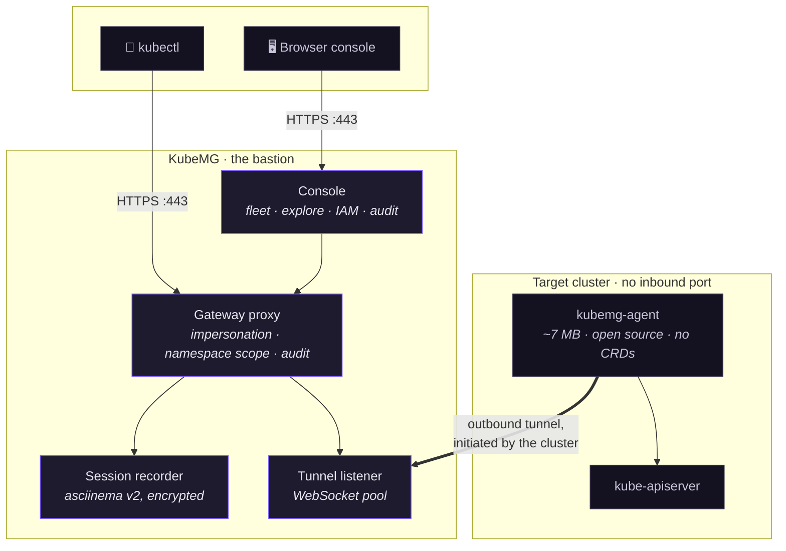
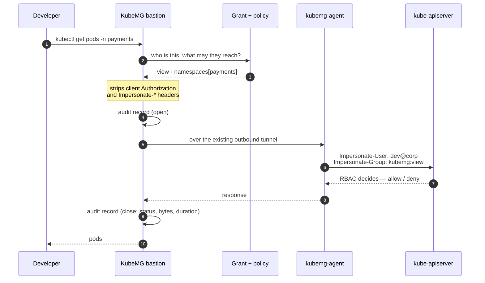
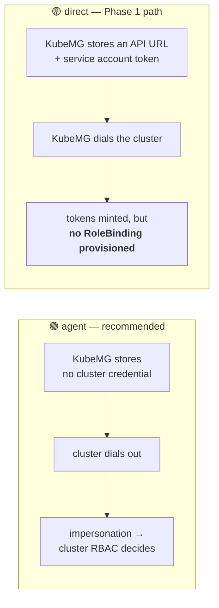
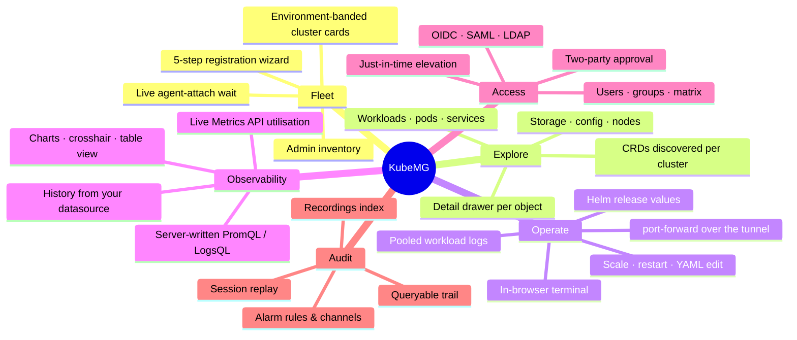
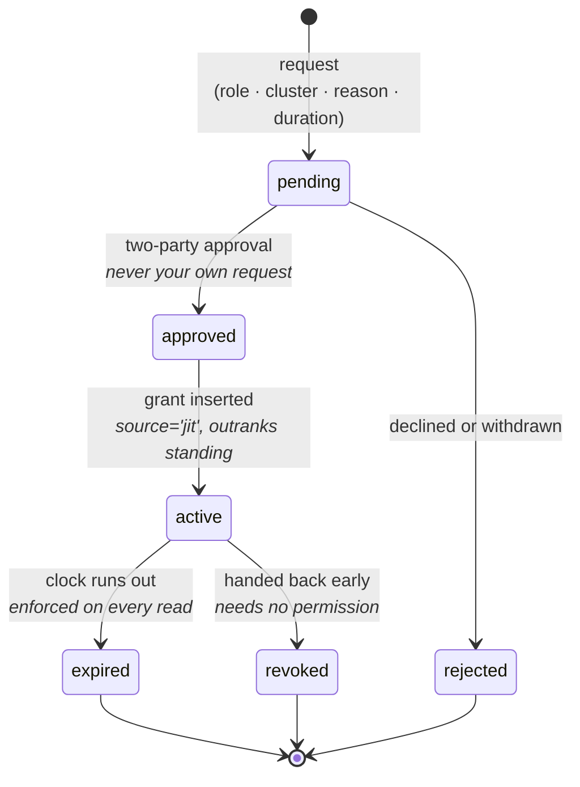
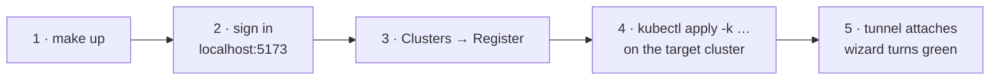

<div align="center">

# KubeMG

**Centralized, audited access to every Kubernetes cluster — without opening one firewall port.**

A lighter alternative to Rancher, Lens or the Kubernetes Dashboard, built around one idea:
**nobody needs network access to a cluster's API server to work with it.**

[](backend/)
[](frontend/)
[](agent/)
[](LICENSE)
[](backend/pkg/db/)
[](Makefile)

</div>

---

Developers reach clusters through KubeMG. KubeMG reaches clusters through an outbound tunnel a
small in-cluster agent opens to it. Every call in between is made under the caller's own
impersonated identity, and every call is audited — including the interactive ones, which are
recorded and replayable.



No inbound firewall rule on the cluster. No heavy in-cluster controller. In agent mode KubeMG
stores **no cluster credential at all** — only the registration token the agent presents when it
dials in.

## Why

| The problem | What KubeMG does |
|---|---|
| **Heavy agents.** Rancher-class platforms install controllers and dozens of CRDs, then want to own the cluster. | Installs a tunnel and nothing else — one Deployment, one Secret, one ServiceAccount. |
| **Desktop tools don't manage teams.** Lens is per-laptop; there is no central place to say who may reach production. | Users, groups, effective-permission merging, and a fleet-wide permission matrix. |
| **Handing out access is an operational wound.** Long-lived kubeconfigs get copied, shared, never revoked. | Short-lived scoped kubeconfigs that point at KubeMG, so revoking access actually revokes it. |
| **"Who ran that in prod?"** has no answer. | Every call audited, refusals included; every shell recorded and replayable. |
| **Standing admin access** because someone needs it twice a quarter. | Just-in-time elevation: a role, a cluster, a mandatory reason and a clock. |

## How a request flows

Every read the console does takes the same path a `kubectl` call does. The UI gets no privileged
shortcut — that is the whole design.



The two things worth noticing: the **cluster's own RBAC** makes the authorization decision, and a
refusal is audited just as loudly as a success.

## Security model

The parts worth reading before trusting it with production.

<table>
<tr><th align="left">Control</th><th align="left">What it actually means</th></tr>
<tr><td><b>Impersonation, not shared service accounts</b></td>
<td>The proxy calls the API server with <code>Impersonate-User</code>/<code>Impersonate-Group</code> derived from the caller's grant. A <code>view</code> grant is read-only because the cluster says so, not because KubeMG remembered to check. Client-supplied impersonation and <code>Authorization</code> headers are stripped.</td></tr>
<tr><td><b>Namespace scope enforced in the proxy</b></td>
<td>A KubeMG concept impersonation groups cannot express, so it is enforced locally: a scoped grant is refused on anything reaching past it, cluster-wide lists included.</td></tr>
<tr><td><b>Everything audited, refusals included</b></td>
<td>A long-lived call (<code>exec</code>, <code>attach</code>, <code>watch</code>, <code>logs -f</code>, <code>port-forward</code>) is recorded twice — at open and at close — so an hour-long session is visible while it is still running. Verbs are named after the subresource: a shell in a production pod reads as <code>exec</code>, never as a <code>get</code>.</td></tr>
<tr><td><b>Sessions recorded and replayable</b></td>
<td>Every <code>exec</code>/<code>attach</code> is teed into a gzipped <a href="https://asciinema.org">asciinema</a> v2 cast, replayed from the audit row it belongs to or from the Recordings index — which lists sessions rather than calls, and shows which shells are open right now.</td></tr>
<tr><td><b>Recordings are the most sensitive artefact here</b></td>
<td>Encrypted at rest (chunked AES-256-GCM, so a trimmed or altered file fails to authenticate rather than replaying short). Keystroke capture is switchable off where operators type credentials. <b>Watching one is itself audited.</b> Reaching somebody else's needs a capability separate from the admin role, grantable only by a super admin. Everyone may always replay their own.</td></tr>
<tr><td><b>Disclosure before the first keystroke</b></td>
<td>The in-browser terminal states what is captured, whether keystrokes are included, whether it is encrypted and how long it is kept — as a persistent line, not a dialog that gets dismissed by reflex.</td></tr>
<tr><td><b>Scoped kubeconfig tokens</b></td>
<td>A kubeconfig lives on a laptop, so the token inside one is minted for exactly one cluster's proxy route and is not a session key for the rest of the API. Revocation works because every proxied call re-reads the user and the grant.</td></tr>
<tr><td><b>The bastion terminates its own TLS</b></td>
<td>Mints a self-signed certificate on first boot when none is configured, and pins it into every rendered agent package. Not decoration: client-go refuses to send a bearer token over plain HTTP, so <code>kubectl exec</code> through the gateway requires TLS.</td></tr>
<tr><td><b>Reads never widen a grant</b></td>
<td>Resource, metrics and Helm reads all go down the same impersonated, audited tunnel. Secret and ConfigMap listings return <b>keys only</b> — no value enters a response.</td></tr>
</table>

### Two connection modes



The direct-mode limitation is **deliberate and disclosed in the UI**: a generated kubeconfig there
authenticates without authorizing, and the permission matrix governs KubeMG's own authorization
rather than the cluster's. Agent mode is where the RBAC story closes.

## What it does



**Fleet** — environment-banded cluster cards leading with the connection state, an admin inventory,
and a five-step registration wizard that waits live for the agent to attach.

**Explore** — a resource browser over live cluster state: namespaces, workloads, pods, services,
ingresses, storage, config, nodes, plus the custom resources a particular cluster actually serves
(the sidebar is built from its own CRD list, with first-class tables for Gateway API and Istio).
One detail drawer per object carries Overview, Describe & Events, YAML and Logs & Terminal, because
finding out something is broken, asking why, and changing it is one investigation.

**Operate** — in-browser terminal and logs (pooled across a workload's pods), scale and restart as
conditional read-modify-writes, a YAML editor, `port-forward` over the tunnel, and Helm release
values.

**Observability** — live utilisation from the cluster's own Metrics API, and history from the
datasource each cluster registers. **The browser never sends a query**: a caller names a chart from
a fixed catalogue and the server writes the PromQL/LogsQL around the scope their grant allows,
because a metrics backend has never heard of the caller and will answer whatever it is asked.

| Metrics | Logs |
|---|---|
| VictoriaMetrics · Prometheus · Thanos · Mimir | VictoriaLogs · Loki |

Reached either **in-cluster** (through the tunnel, via the API server's service proxy — nothing
exposed) or **direct** (dialled from the bastion, the shape a central Thanos takes).

**Access** — local users and groups with effective-permission merging, a permission matrix,
federation with OIDC, SAML and LDAP including IdP group mapping, and just-in-time elevation:



An elevation is a **grant of its own, never an edit of the standing one** — so expiry needs no
restore step and nobody loses access they permanently hold.

**Audit** — a queryable trail with session replay, and a recordings index beside it for the sessions
themselves. Both are readable by everyone, and both narrow a non-admin to their own activity.
Alarm rules route cluster events and KubeMG's own audit records to Alertmanager, Slack, Teams,
PagerDuty, ServiceNow or a raw SIEM webhook.

## Quick start

Everything builds and runs in containers. **No Go, Node or npm on the host** — Docker and `make`
are the only requirements.



### 1. Bring the stack up

```bash
git clone https://github.com/ozkanpoyrazoglu/kubemg.git
cd kubemg
cp .env.example .env      # optional: only if the defaults are wrong for your machine
make up                   # backend + frontend + PostgreSQL 16
make logs                 # follow
```

| Service | Address |
|---|---|
| Console | <http://localhost:5173> |
| API / bastion | `https://localhost:8443` (self-signed cert, minted at first boot) |
| PostgreSQL | `localhost:5432` |

Sign in as `admin` / `admin`. **Change it** — it is a development default, seeded only while the
users table is empty.

### 2. Point the bastion at an address your cluster can reach

`KUBEMG_PUBLIC_URL` is baked into every generated install command, so it must be the address the
*target cluster* dials — not the container's own, and not loopback unless the cluster runs on this
same host. Put it in `.env`:

```bash
KUBEMG_PUBLIC_URL=https://192.0.2.10:8443
KUBEMG_TLS_HOSTS=kubemg-backend,backend,192.0.2.10
KUBEMG_SESSION_RECORDING_KEY=$(openssl rand -base64 32)
```

Then `make down && make up`. It is also editable at runtime from **Settings** without a restart.

### 3. Attach your first cluster

**Clusters → Register**, pick *Agent-based*, and run the one-line command the wizard renders against
your cluster:

```bash
kubectl apply -k https://your-kubemg/install/<token>/kustomize.tar.gz
```

The wizard polls every 3 seconds and turns green the moment the tunnel attaches — the whole point of
that step, since you are pasting into a terminal somewhere else. What lands in the cluster:

```
namespace/kubemg-system
serviceaccount/kubemg-agent
secret/kubemg-agent            ← bastion URL, registration token, pinned CA
deployment/kubemg-agent        ← one replica, ~7 MB, no CRDs
clusterrolebindings            ← kubemg:view / :edit / :cluster-admin
```

Uninstall is `kubectl delete -k …`. Nothing else is left behind.

> **Existing agent installs must re-apply their manifests** to pick up the CRD-discovery and
> custom-resource ClusterRoles; until they do, discovery 403s and the Explore sidebar simply shows
> no custom resources.

### 4. Give someone access

**Access → Permissions**, pick a user or group, a cluster and a role (`view` / `edit` /
`cluster-admin`), optionally scoped to namespaces. Then **Kubeconfig** on the cluster page issues a
scoped, short-lived file that points at KubeMG rather than at the cluster.

## Configuration

<details>
<summary><b>Server environment (click to expand — all optional, these are the defaults)</b></summary>

| Variable | Default | What it is |
|---|---|---|
| `KUBEMG_LISTEN_ADDR` | `:8080` | Listen address |
| `DB_HOST` … `DB_SSLMODE` | localhost / kubemg | PostgreSQL 16 connection |
| `JWT_SECRET`, `JWT_TTL` | dev secret, `12h` | Session signing |
| `KUBEMG_ADMIN_USERNAME` / `_PASSWORD` | `admin` / `admin` | Bootstrap admin, seeded only when the users table is empty |
| `KUBEMG_PUBLIC_URL` | `http://localhost:8080` | The outside address agents and operators reach; baked into install commands |
| `CORS_ALLOWED_ORIGINS` | Vite dev server | Where the browser app may live |
| `KUBEMG_AGENT_IMAGE`, `KUBEMG_AGENT_NAMESPACE` | pinned image, `kubemg-system` | Rendered into agent manifests |
| `KUBEMG_TLS_ENABLED` | `false` | Terminate HTTPS here. Required for `kubectl` through the proxy |
| `KUBEMG_TLS_CERT_FILE`, `_KEY_FILE` | `/etc/kubemg/tls/tls.*` | Certificate material; a self-signed pair is minted if absent |
| `KUBEMG_TLS_SELF_SIGNED`, `KUBEMG_TLS_HOSTS` | `true`, — | Whether to mint, and extra SANs |
| `KUBEMG_AGENT_CA_BUNDLE` | — | The chain agents must trust. Set it behind an ingress or an internal PKI, where nothing here can infer it |
| `KUBEMG_AUDIT_RETENTION_DAYS` | `30` | Retention for the trail *and* the recordings; also settable at runtime |
| `KUBEMG_RESOURCE_CACHE_TTL` | `5s` | Per-caller read cache; negative turns it off |
| `KUBEMG_SESSION_RECORDING_ENABLED` | `true` | Record `exec`/`attach` for replay |
| `KUBEMG_SESSION_RECORDING_DIR` | `/var/lib/kubemg/recordings` | Where casts are written. **Mount it** — recordings must outlive the container |
| `KUBEMG_SESSION_RECORDING_MAX_BYTES` | 32 MiB | Per-recording cap |
| `KUBEMG_SESSION_RECORDING_KEY` | — | 32 bytes, hex or base64 (`openssl rand -base64 32`): encrypts recordings at rest. **Set it.** Keep it out of the backup that holds the recordings volume; losing it loses the recordings |
| `KUBEMG_SESSION_RECORDING_INPUT` | `true` | Record keystrokes as well as output. `false` keeps only what the container printed |

</details>

**Agent**: `KUBEMG_BASTION_URL`, `KUBEMG_CLUSTER_TOKEN`, `KUBEMG_BASTION_CA` (added to the system
roots, not replacing them), and `KUBEMG_BASTION_INSECURE_SKIP_VERIFY` for hand-running against a dev
bastion. The rendered manifests set all of these for you.

### Production checklist

- [ ] Real TLS material mounted over `/etc/kubemg/tls`, or `KUBEMG_AGENT_CA_BUNDLE` set behind an ingress
- [ ] `JWT_SECRET` replaced; bootstrap admin password changed
- [ ] `KUBEMG_SESSION_RECORDING_KEY` generated per install and kept out of the recordings backup
- [ ] `KUBEMG_SESSION_RECORDING_DIR` on a persistent volume
- [ ] `KUBEMG_PUBLIC_URL` = the address your clusters dial, over HTTPS
- [ ] Managed PostgreSQL with `DB_SSLMODE=require`
- [ ] Retention window set to whatever your auditors need

## Repository layout

```
backend/            Go server: Gin + GORM + PostgreSQL 16
  pkg/bastion/        tunnel listener, kubectl proxy, streaming, audit
  pkg/api/            HTTP surface: clusters, IAM, resources, observability, audit
  pkg/terminal/       session recording (asciinema v2, encrypted)
  pkg/jit/            just-in-time elevation engine
  pkg/db/             models and query layer
  pkg/auth/ k8s/ certs/ observability/ cache/ agentpkg/
frontend/           Vite + React + TypeScript + Tailwind v4
agent/              the in-cluster agent — a separate Go module
deploy/kustomize/   the agent's install manifests (human-facing copy)
```

The agent is its own module on purpose: it depends only on `gorilla/websocket`, has no client-go,
and compiles to about 7 MB. The manifests exist twice — `deploy/kustomize/base/` for people and an
embedded copy the server renders from — and `make manifest-check` fails if they drift.

## Development

All tooling runs in containers:

```bash
make verify        # manifest-check + vet + tests + builds + frontend lint/build
make test          # backend + agent tests
make backend-test  # go test ./...
make frontend-lint
make up / down / logs / ps
```

`docker-compose.ci.yml` exposes the same jobs as services for CI runners.

## Status

```mermaid
gantt
    title Roadmap
    dateFormat X
    axisFormat %s
    section Shipped
    Phase 1 · Multi-cluster IAM & kubeconfig      :done, p1, 0, 1
    Phase 2 · Bastion, agent, impersonation, audit :done, p2, 1, 2
    Phase 3 · Single pane of glass & observability :done, p3, 2, 3
    Phase 4 · SSO federation (OIDC/SAML/LDAP)      :done, p4, 3, 4
    section In progress
    Phase 5 · Zero-trust · recording · JIT · guardrails :active, p5, 4, 5
    section Next
    Phase 6 · FinOps · topology · AI RCA · GitOps drift :p6, 5, 6
```



Phases 1–4 are in place. Phase 5 is under way — session recording and replay, JIT elevated access
and command guardrails have landed. The auto-provisioned VictoriaMetrics/VictoriaLogs stack is not
built yet; bring your own for now.

## Licensing

Two licences, split by directory.

| Path | Licence | Why |
|---|---|---|
| Everything else — server, console | **AGPL-3.0** ([`LICENSE`](LICENSE)) | Running a modified KubeMG as a network service means offering that modified source to its users. Section 13 is the point: this is a product people host for others. |
| [`agent/`](agent/), [`deploy/kustomize/`](deploy/kustomize/) | **Apache-2.0** ([`agent/LICENSE`](agent/LICENSE)) | The only component that runs **inside a customer's cluster**. A SecOps team has to be able to read it, build it themselves and vendor it into their own tooling without copyleft reaching their infrastructure. |

Third-party dependency licences are listed in full in [`NOTICE`](NOTICE); all of them are permissive
(MIT, BSD, Apache-2.0, ISC, OFL).

**A commercial licence is available.** Copyright is held in full by the author, so the AGPL is not
the only terms on which this can be had — if its source-offering obligation does not fit an embedded
or OEM deployment, contact the maintainer. That does not withdraw the AGPL grant; it stands for
everyone else.

## Security

Please report vulnerabilities **privately to the maintainer** rather than opening a public issue. If
you are evaluating KubeMG for production, the security model section above is the honest short
version — including the direct-mode limitation.
