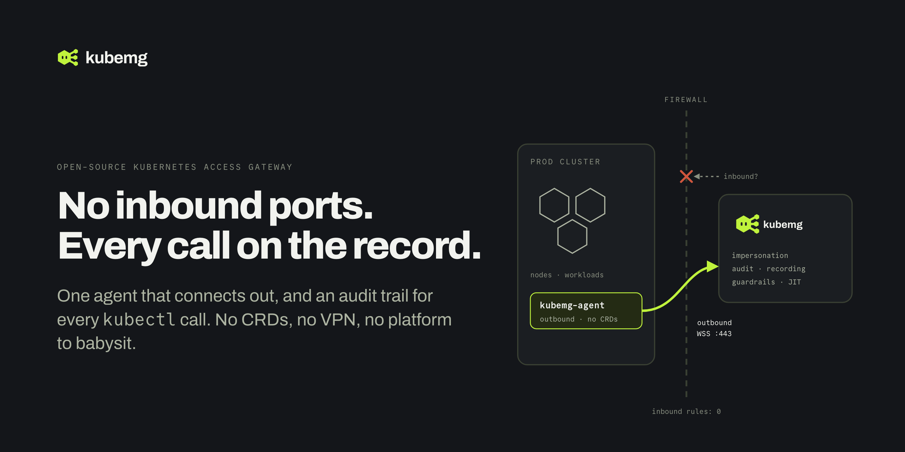
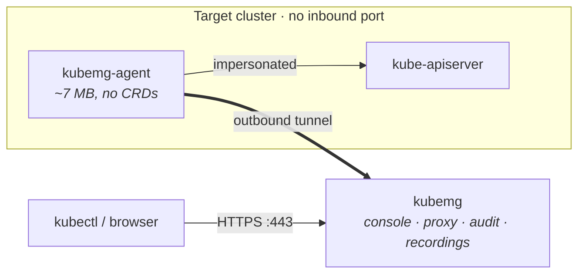
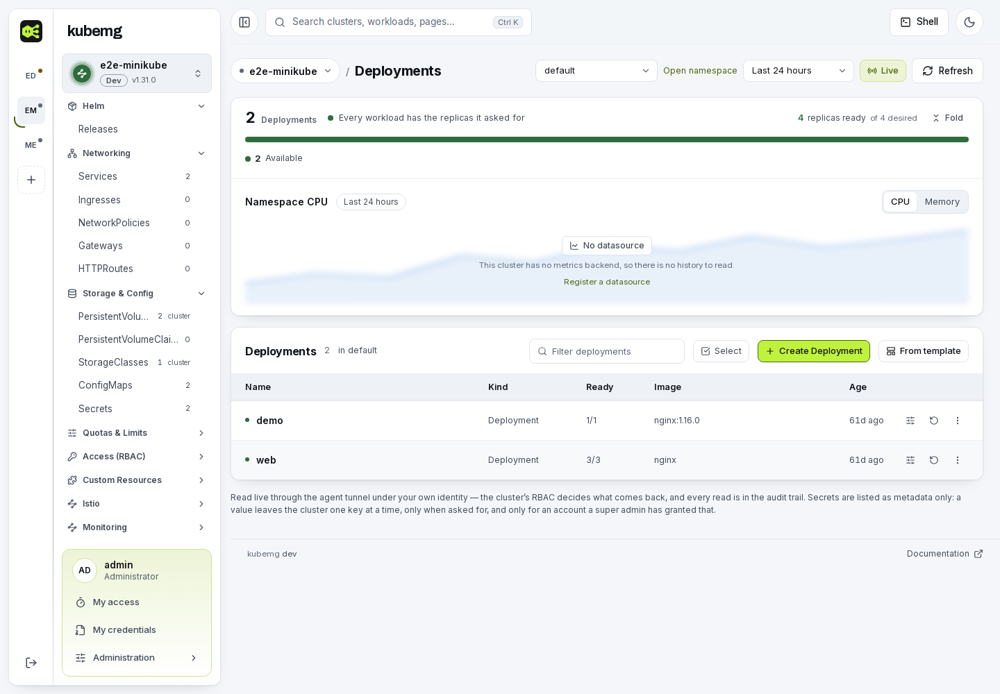
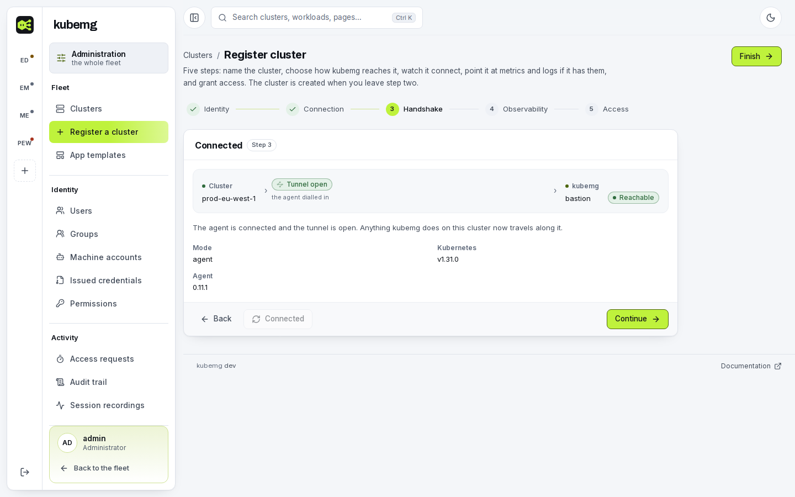
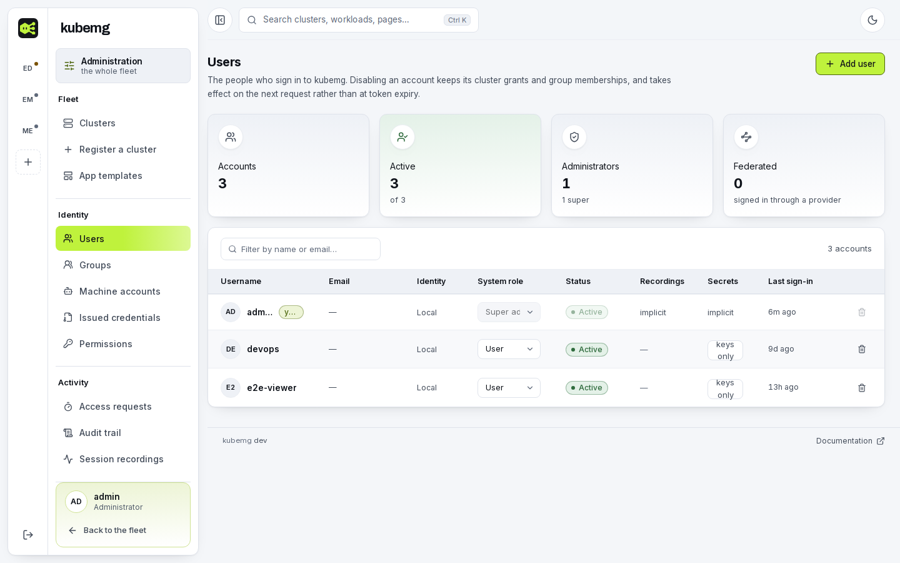
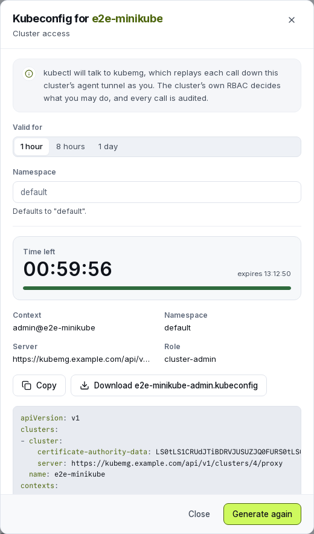
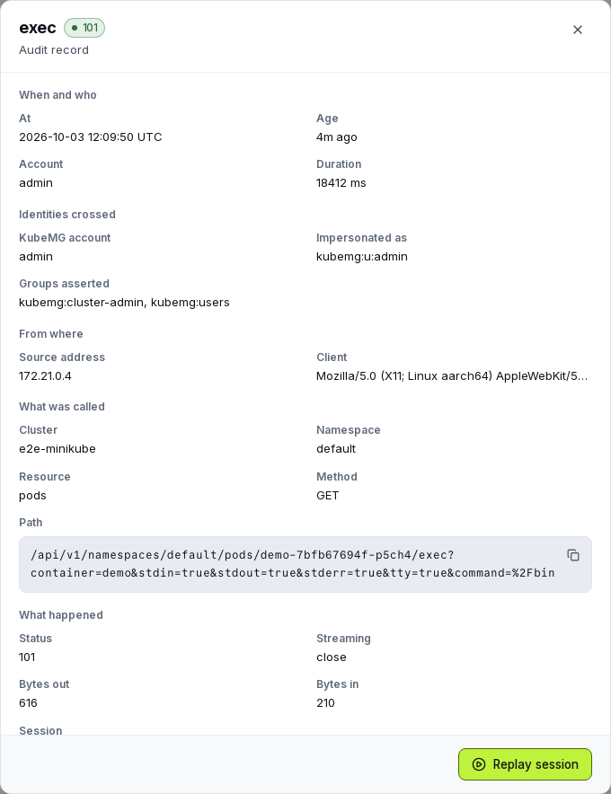
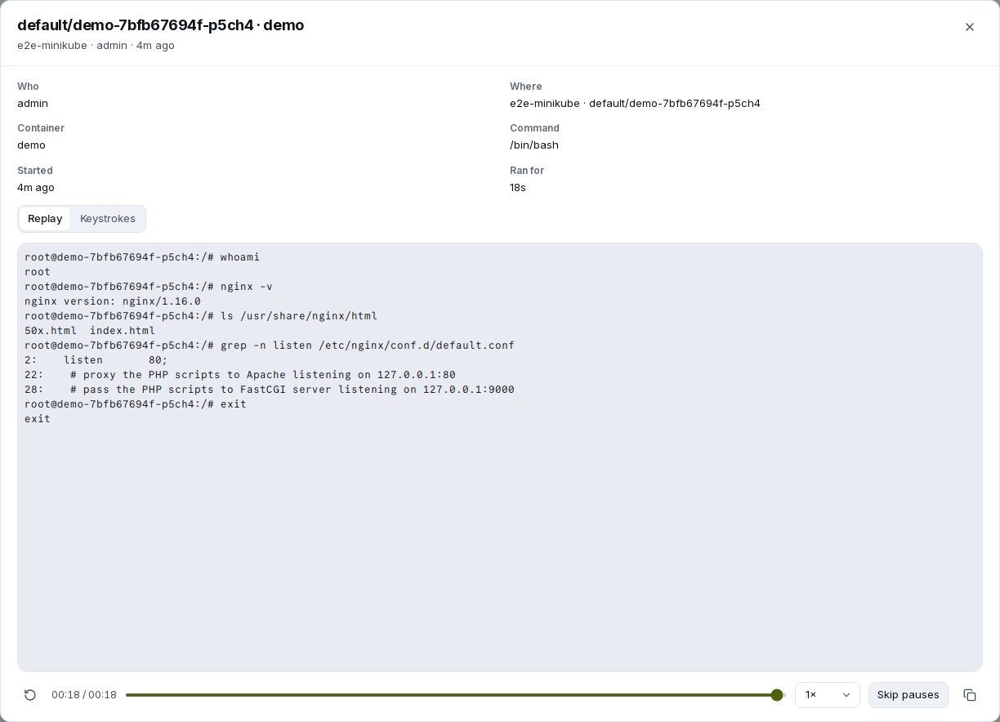

<div align="center">



Central, audited access to every Kubernetes cluster — one small agent that dials out,
no CRDs, and every `kubectl` call on the record.

**[Documentation](https://kubemg.readthedocs.io/)** ·
[Quickstart](https://kubemg.readthedocs.io/en/latest/getting-started/quickstart/) ·
[Install on Kubernetes](https://kubemg.readthedocs.io/en/latest/install/kubernetes/) ·
[Security model](https://kubemg.readthedocs.io/en/latest/introduction/security-model/) ·
[Developer guide](https://kubemg.readthedocs.io/en/latest/dev/)

[](https://kubemg.readthedocs.io/) [](https://github.com/kubemg/kubemg/releases) [](agent/) [](LICENSE)

</div>

---

kubemg is a self-hosted access gateway and console for a fleet of Kubernetes clusters.

- **One agent per cluster, dialling out.** ~7 MB, one Deployment, no controllers, no CRDs, no inbound firewall rule.
- **The cluster's own RBAC decides.** Every call — from the console or from a developer's own `kubectl` — goes down the tunnel under the caller's impersonated identity.
- **Everything is on the record.** Every call is audited, refusals included, and every shell session is recorded and replayable.
- **Access that ends.** Short-lived, revocable kubeconfigs, SSO, and just-in-time elevation with two-party approval.


```mermaid
flowchart LR
    U["kubectl / browser"] -- "HTTPS :443" --> B["kubemg<br/><i>console · proxy · audit · recordings</i>"]
    A["kubemg-agent<br/><i>~7 MB, no CRDs</i>"] == "outbound tunnel" ==> B
    A -- "impersonated" --> K["kube-apiserver"]
    subgraph cluster["Target cluster · no inbound port"]
        A
        K
    end
```

The bastion is the trust anchor: with the tunnel it is, in effect, `system:masters` on every
agent-mode cluster — the same trust model as Rancher or Teleport, with far less running inside the
cluster. The [threat model](https://kubemg.readthedocs.io/en/latest/introduction/threat-model/)
says what each compromise reaches and what bounds it.

## A look at the console

<p align="center">
  
  <br><sub><b>Explore</b> — live cluster state through the agent tunnel, under your own identity.</sub>
</p>

<table>
<tr>
<td width="50%"><br><sub><b>Register a cluster</b> — one <code>kubectl apply</code>, and the wizard waits live for the tunnel.</sub></td>
<td width="50%"><br><sub><b>Users and access</b> — local and federated accounts, groups, per-cluster grants.</sub></td>
</tr>
</table>

<table>
<tr>
<td width="31%"><br><sub><b>Kubeconfig</b> — scoped to one cluster, expiring, revocable.</sub></td>
<td width="31%"><br><sub><b>Audit record</b> — who, as whom, from where, and the result.</sub></td>
<td width="38%"><br><sub><b>Session replay</b> — every <code>exec</code> recorded, encrypted at rest.</sub></td>
</tr>
</table>

## What it does

| | |
|---|---|
| **Fleet** | Cluster overview, a five-step registration wizard, agent or direct connection mode |
| **Explore** | Workloads, networking, storage, config, nodes, RBAC and each cluster's own CRDs; describe, events, YAML, a traffic and dependency map |
| **Operate** | Terminal, pooled logs, `port-forward`, scale / restart / suspend, create from a form or a template, Helm install / upgrade / rollback / uninstall, a browser `kubectl` shell |
| **Observe** | Live utilisation, node capacity (reserved vs used vs limits), metrics and logs from VictoriaMetrics, Prometheus, Thanos, Mimir, VictoriaLogs or Loki, Alertmanager alerts and silences |
| **Access** | Users, groups, namespace-scoped grants, OIDC / SAML / LDAP (Okta included), machine accounts, kubeconfig register and revocation, just-in-time elevation |
| **Audit** | Queryable trail, session recording and replay, syslog forwarding to a SIEM, alarms to Slack, Teams, PagerDuty, ServiceNow or Alertmanager |
| **Guardrails** | Rules that block or warn on a destructive call — including line by line inside an interactive shell |
| **Security** | Workload posture against Pod Security Standards, the cluster's own RBAC read back, credentials encrypted at rest |

## Quick start

Docker and nothing else. The production image pulls ready-made; no toolchain needed.

```bash
git clone https://github.com/kubemg/kubemg.git
cd kubemg/deploy/compose
docker compose up -d
docker compose logs kubemg | grep -A6 'not configured yet'   # the generated admin password
```

Open `https://<your-host>:8443`, sign in, and the setup wizard walks you through the rest. Then
**Register a cluster** and run the one command it gives you on the target cluster:

```bash
kubectl apply -k https://<your-kubemg>/install/<ticket>/kustomize.tar.gz
```

On Kubernetes, use the Helm chart:

```bash
helm install kubemg oci://ghcr.io/kubemg/charts/kubemg --namespace kubemg --create-namespace \
  --set publicURL=https://kubemg.example.com \
  --set postgresql.enabled=true --set database.password=evaluation-only \
  --set service.type=LoadBalancer
```

Next: [Docker Compose](https://kubemg.readthedocs.io/en/latest/install/docker-compose/) ·
[Kubernetes](https://kubemg.readthedocs.io/en/latest/install/kubernetes/) ·
[Air-gapped](https://kubemg.readthedocs.io/en/latest/install/air-gapped/) ·
[Production checklist](https://kubemg.readthedocs.io/en/latest/install/production-checklist/)

## Roadmap

**Shipped** — all of this is in the current release:

| Phase | | |
|---|---|---|
| 1 | MVP | Multi-cluster users, groups and grants; short-lived kubeconfigs |
| 2 | Bastion & agent | Outbound tunnel, impersonation, audit trail, streaming `exec` / `logs -f` |
| 3 | Single pane of glass | Explore, CRD discovery, Helm, metrics and logs, `port-forward`, TLS |
| 4 | SSO | OIDC, SAML, LDAP, IdP group mapping |
| 5 | Zero trust | Session recording, JIT elevation, guardrails, alarms, audit forwarding |
| 6 | Console IA | Cluster-scoped navigation, one detail drawer, contrast gate |
| 6.5 | Security & lifecycle | Helm rollback and uninstall, RBAC visibility, events, posture, capacity, credential register, browser shell |
| 6.6 | Enterprise readiness | Notifications, audit as evidence, branding, access review, sign-in page |
| — | Packaging | Production image, pull-only compose, Helm chart, air-gapped bundle |
| — | Security hardening | Prefixed impersonation identity, single-use install URLs, secrets encrypted at rest |
| 7 | | Traffic and dependency map |

**Next — Phase 7:**

- [ ] **MCP servers** — opt-in Kubernetes and Grafana MCP servers for AI assistants, read-only by default
- [ ] **FinOps** — workload cost estimation, waste detection, right-sizing
- [ ] **Node capacity heatmap** — allocation and oversubscription across the fleet
- [ ] **AI root-cause analysis** — `CrashLoopBackOff`, `OOMKilled`, node pressure and log anomalies explained
- [ ] **GitOps drift** — live state compared with the Git manifests that produced it

**Also open:**

- [ ] Rate limiting per user and cluster at the proxy
- [ ] Audit records for kubemg's own pre-tunnel refusals, and for the name of a created object
- [ ] Key rotation for `KUBEMG_SECRET_KEY`; sealing alarm-channel headers
- [ ] A non-zero `kubectl exec` exit when the tunnel drops mid-session
- [ ] An external security review and a second core maintainer

## Development

Everything builds and runs in containers — Docker and `make` are the only requirements.

```bash
make up        # dev stack: console on :5173, API on :8443, admin / admin
make verify    # everything CI runs
```

See the [Developer guide](https://kubemg.readthedocs.io/en/latest/dev/) for the layout, the
internals and how to contribute.

## License

Open source in full — no compiled core, no licence key.

| Path | Licence |
|---|---|
| Server and console | [AGPL-3.0](LICENSE) |
| [`agent/`](agent/), [`deploy/kustomize/`](deploy/kustomize/) — what runs in your cluster | [Apache-2.0](agent/LICENSE) |

A commercial licence is available for embedded or OEM use; it does not withdraw the AGPL grant.
Third-party licences are in [`NOTICE`](NOTICE).

## Security

Report vulnerabilities **privately to the maintainer**, not in a public issue.
