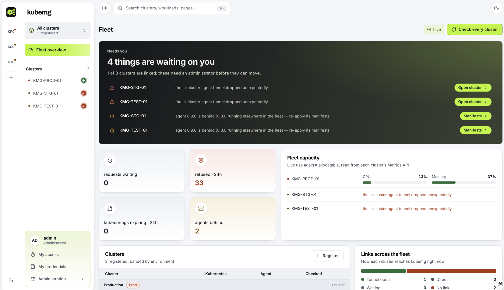
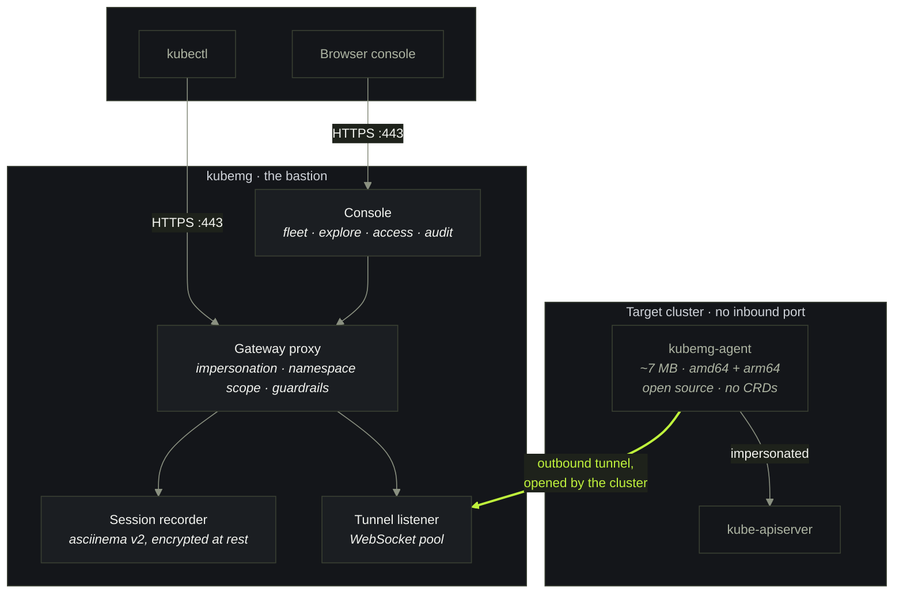
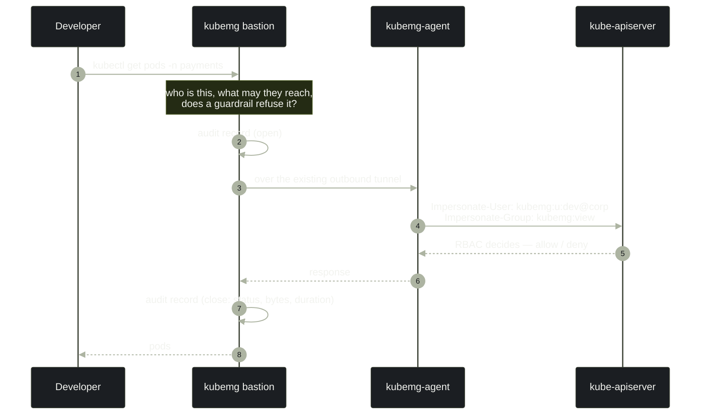
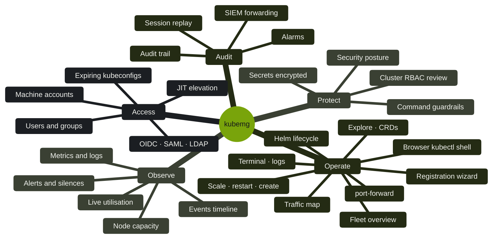
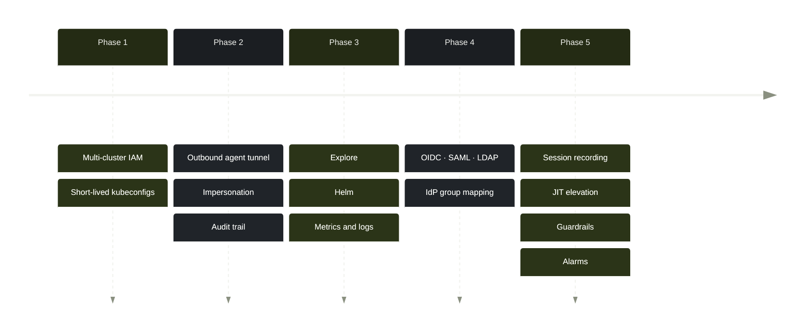
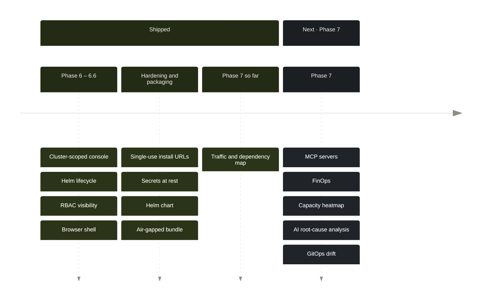

<div align="center">


Central, audited access to every Kubernetes cluster — one small agent that dials out,
no CRDs, and a bastion that says plainly what it is trusted with.

**[Documentation](https://kubemg.readthedocs.io/)** ·
[Quickstart](https://kubemg.readthedocs.io/en/latest/getting-started/quickstart/) ·
[Install on Kubernetes](https://kubemg.readthedocs.io/en/latest/install/kubernetes/) ·
[Security model](https://kubemg.readthedocs.io/en/latest/introduction/security-model/) ·
[Threat model](https://kubemg.readthedocs.io/en/latest/introduction/threat-model/) ·
[Developer guide](https://kubemg.readthedocs.io/en/latest/dev/)

[](https://kubemg.readthedocs.io/) [](https://github.com/kubemg/kubemg/releases) [](agent/) [](backend/) [](frontend/) [](backend/pkg/db/) [](LICENSE)

</div>

---

<p align="center">
  
  <br><sub><b>The fleet overview</b> — what needs you, what was refused, fleet capacity, and how every cluster is linked right now.</sub>
</p>

## What kubemg is

There are three common ways to give a developer access to a production cluster, and each has a
cost:

- **Hand out a kubeconfig.** It is long-lived, it gets copied, and revoking it means first
  remembering that it exists.
- **Put a desktop tool in front of it.** Lens is a good console for one person, but there is
  nowhere in it to say who may reach production, and no record of who did.
- **Install a platform.** Rancher-class tools arrive with controllers and CRDs and expect to own
  the cluster.

kubemg is a fourth way: **~7 MB in the cluster, everything else at the bastion.**

| kubemg is | kubemg is not |
|---|---|
| A self-hosted access gateway and console for a fleet of Kubernetes clusters | A cluster provisioner or lifecycle manager |
| One small agent per cluster that dials **out** — no inbound port, no CRDs, no controllers | A monitoring stack — it reads the Prometheus/Loki-style backend you already run |
| Every call under the caller's own impersonated identity, decided by **the cluster's own RBAC** | A replacement for Kubernetes RBAC — it builds on it |
| A record of every call, refusals included, and every shell session replayable | A desktop app — it is one server and a browser console, open source in full |

> [!IMPORTANT]
> **The bastion is the trust anchor.** The agent may impersonate and forwards what the bastion
> sends, so the bastion plus the tunnel is, in effect, `system:masters` on every agent-mode
> cluster — the same trust model as Rancher's cluster agent or Teleport's Kubernetes Service, with
> far less running inside the cluster. Harden the bastion, its database and its signing key first.
> The [threat model](https://kubemg.readthedocs.io/en/latest/introduction/threat-model/) goes
> through each compromise scenario and what bounds it.

## How it works


```mermaid
%%{init: {'theme':'base','themeVariables':{
  'fontFamily':'-apple-system, BlinkMacSystemFont, Segoe UI, Helvetica, Arial, sans-serif','fontSize':'14px',
  'primaryColor':'#1B1E22','primaryTextColor':'#F2F3EF','primaryBorderColor':'#3A4033',
  'lineColor':'#8A9080','textColor':'#F2F3EF',
  'clusterBkg':'#14161A','clusterBorder':'#3A4033'
}}}%%
flowchart TB
    subgraph users[" "]
        direction LR
        U1["kubectl"]
        U2["Browser console"]
    end

    subgraph bastion["kubemg · the bastion"]
        direction TB
        C["Console<br/><i>fleet · explore · access · audit</i>"]
        P["Gateway proxy<br/><i>impersonation · namespace scope · guardrails</i>"]
        R["Session recorder<br/><i>asciinema v2, encrypted at rest</i>"]
        T["Tunnel listener<br/><i>WebSocket pool</i>"]
    end

    subgraph cluster["Target cluster · no inbound port"]
        A["kubemg-agent<br/><i>~7 MB · amd64 + arm64<br/>open source · no CRDs</i>"]
        K["kube-apiserver"]
    end

    U1 -- "HTTPS :443" --> P
    U2 -- "HTTPS :443" --> C
    C --> P
    P --> R
    P --> T
    A == "outbound tunnel,<br/>opened by the cluster" ==> T
    A -- "impersonated" --> K

    classDef core fill:#1B1E22,stroke:#3A4033,color:#F2F3EF
    classDef quiet fill:#14161A,stroke:#3A4033,color:#ADB4A2
    class C,P,R,T core
    class A,K,U1,U2 quiet

    linkStyle 5 stroke:#BFF23C,stroke-width:2.5px,color:#BFF23C
```

1. The agent opens **one outbound WebSocket** to kubemg and holds it. In agent mode kubemg stores
   no Kubernetes credential — only the registration token the agent presents when it dials in.
2. A developer calls kubemg — from the console, or with their own `kubectl` and a short-lived
   kubeconfig that points at kubemg rather than at the cluster.
3. kubemg resolves who they are and what they were granted, strips any client-supplied
   `Authorization`/`Impersonate-*` headers, checks the guardrails, and records the call.
4. The call goes down the tunnel as `Impersonate-User: kubemg:u:<username>` in kubemg's own groups.
   **The cluster's RBAC decides**, and the result — allowed or refused — is recorded either way.


```mermaid
%%{init: {'theme':'base','themeVariables':{
  'fontFamily':'-apple-system, BlinkMacSystemFont, Segoe UI, Helvetica, Arial, sans-serif','fontSize':'13px',
  'actorBkg':'#1B1E22','actorBorder':'#3A4033','actorTextColor':'#F2F3EF','actorLineColor':'#3A4033',
  'signalColor':'#ADB4A2','signalTextColor':'#F2F3EF',
  'noteBkgColor':'#242B14','noteBorderColor':'#4B5A22','noteTextColor':'#F2F3EF',
  'labelBoxBkgColor':'#1B1E22','labelBoxBorderColor':'#3A4033','labelTextColor':'#F2F3EF',
  'sequenceNumberColor':'#14161A','activationBkgColor':'#3A4033',
  'lineColor':'#8A9080','textColor':'#F2F3EF','primaryColor':'#BFF23C'
}}}%%
sequenceDiagram
    autonumber
    participant D as Developer
    participant B as kubemg bastion
    participant A as kubemg-agent
    participant K as kube-apiserver

    D->>B: kubectl get pods -n payments
    Note over B: who is this, what may they reach,<br/>does a guardrail refuse it?
    B->>B: audit record (open)
    B->>A: over the existing outbound tunnel
    A->>K: Impersonate-User: kubemg:u:dev@corp<br/>Impersonate-Group: kubemg:view
    K-->>A: RBAC decides — allow / deny
    A-->>B: response
    B->>B: audit record (close: status, bytes, duration)
    B-->>D: pods
```

The console gets no privileged shortcut: every read it makes takes the same path a `kubectl` call
does.

**Two connection modes.** *Agent* mode is the one described above and the one to use. *Direct*
mode stores an API URL and a service-account token and dials the cluster itself; it needs no agent,
but it provisions no RoleBinding, so a kubeconfig there authenticates without authorizing — the UI
says so wherever it applies. See
[Connection modes](https://kubemg.readthedocs.io/en/latest/clusters/connection-modes/).

## What it does


```mermaid
%%{init: {'theme':'base','themeVariables':{
  'fontFamily':'-apple-system, BlinkMacSystemFont, Segoe UI, Helvetica, Arial, sans-serif','fontSize':'14px',
  'primaryColor':'#BFF23C','primaryTextColor':'#14161A','primaryBorderColor':'#BFF23C',
  'lineColor':'#8A9080',
  'cScale0':'#1B1E22','cScaleLabel0':'#F2F3EF',
  'cScale1':'#242B14','cScaleLabel1':'#F2F3EF',
  'cScale2':'#3A4033','cScaleLabel2':'#F2F3EF',
  'cScale3':'#1B1E22','cScaleLabel3':'#F2F3EF',
  'cScale4':'#242B14','cScaleLabel4':'#F2F3EF',
  'cScale5':'#3A4033','cScaleLabel5':'#F2F3EF',
  'cScale6':'#1B1E22','cScaleLabel6':'#F2F3EF'
}}}%%
mindmap
  root((kubemg))
    Operate
      Fleet overview
      Registration wizard
      Explore · CRDs
      Traffic map
      Terminal · logs
      port-forward
      Browser kubectl shell
      Scale · restart · create
      Helm lifecycle
    Observe
      Live utilisation
      Node capacity
      Metrics and logs
      Alerts and silences
      Events timeline
    Access
      Users and groups
      OIDC · SAML · LDAP
      Expiring kubeconfigs
      Machine accounts
      JIT elevation
    Audit
      Audit trail
      Session replay
      SIEM forwarding
      Alarms
    Protect
      Command guardrails
      Security posture
      Cluster RBAC review
      Secrets encrypted
```

<table>
<tr>
<td width="50%"><br><sub><b>Explore</b> — workloads, networking, storage, config, RBAC and each cluster's own CRDs, with one detail drawer per object.</sub></td>
<td width="50%"><br><sub><b>Register a cluster</b> — one <code>kubectl apply</code>, and the wizard waits live for the tunnel.</sub></td>
</tr>
<tr>
<td width="50%"><br><sub><b>Users and access</b> — local and federated accounts, groups, per-cluster and per-namespace grants.</sub></td>
<td width="50%"><br><sub><b>Session replay</b> — every <code>exec</code> and <code>attach</code> recorded, encrypted at rest, and replayable.</sub></td>
</tr>
</table>

**Operate.** A resource browser over live cluster state — the sidebar is built from each cluster's
own CRD list, with first-class tables for Gateway API and Istio. Pod and workload lists open on a
summary of what is wrong in them, in the cluster's own words (`CrashLoopBackOff`, `OOMKilled`).
From the detail drawer: describe and events, YAML, logs pooled across a workload's pods, a terminal,
`port-forward`, scale and restart, and Helm releases installed, upgraded, rolled back and uninstalled
down the same tunnel.

**Observe.** Live utilisation from the cluster's Metrics API, node capacity as reserved vs used vs
limits, and history from the datasource each cluster registers — VictoriaMetrics, Prometheus,
Thanos or Mimir for metrics, VictoriaLogs or Loki for logs. **The browser never sends a query**:
the server writes the PromQL/LogsQL around the scope the caller's grant allows.

**Access.** Users and groups with effective-permission merging, namespace-scoped grants, SSO over
OIDC, SAML and LDAP with IdP group mapping, machine accounts for pipelines, and kubeconfigs that
expire and can be revoked. For access someone needs twice a quarter, **just-in-time elevation**: a
role, a cluster, a mandatory reason and a clock, approved by somebody other than the requester.

**Audit.** Every call is recorded — refusals included, and long-lived calls (`exec`, `logs -f`,
`port-forward`) at both open and close. Shells are recorded and replayable, which is the half no
cluster-side audit can see: everything typed inside a shell is invisible to the API server. The
trail can be forwarded to a SIEM over syslog, and alarms route cluster events and kubemg's own
audit records to Alertmanager, Slack, Teams, PagerDuty, ServiceNow or a webhook.

**Protect.** Command guardrails refuse a destructive call — `kubectl delete ns prod` at 03:00 —
even from someone entitled to make it, including line by line inside an interactive shell.

## Install

Everything runs in containers; there is no toolchain to install.

### Try it with Docker Compose

The production image, pulled ready-made — no source build:

```bash
git clone https://github.com/kubemg/kubemg.git
cd kubemg/deploy/compose
docker compose up -d
docker compose logs kubemg | grep -A6 'not configured yet'   # the generated admin password
```

Open `https://<your-host>:8443` and sign in. The certificate is self-signed on first boot, so the
browser warns once. A **setup wizard** then asks for a new administrator password, the address
clusters will dial, where the agent image comes from, what the audit trail keeps and, optionally, an
SSO provider. Everything it collects is editable later from **Settings**.

### Install on Kubernetes

```bash
helm install kubemg oci://ghcr.io/kubemg/charts/kubemg --namespace kubemg --create-namespace \
  --set publicURL=https://kubemg.example.com \
  --set postgresql.enabled=true --set database.password=evaluation-only \
  --set service.type=LoadBalancer
```

That is an evaluation install with an in-chart PostgreSQL. For production, point the chart at your
own database and supply the keys from a Secret — see the
[Kubernetes install guide](https://kubemg.readthedocs.io/en/latest/install/kubernetes/).
[Air-gapped installs](https://kubemg.readthedocs.io/en/latest/install/air-gapped/) are covered too.

### Attach a cluster

**Admin → Register a cluster**, pick *Agent-based*, and run the command the wizard renders against
the target cluster:

```bash
kubectl apply -f https://<your-kubemg>/install/<ticket>/agent.yaml
```

The URL carries a single-use download ticket, never the agent's credential. The wizard turns green
the moment the tunnel attaches. What lands in the cluster:

```
namespace/kubemg-system
serviceaccount/kubemg-agent
secret/kubemg-agent            ← bastion URL, registration token, pinned CA
deployment/kubemg-agent        ← one replica, ~7 MB, no CRDs
clusterroles + bindings        ← impersonation, kubemg:view / :edit / :cluster-admin
```

### Give someone access

**Admin → Permissions**: pick a user or group, a cluster and a role (`view`, `edit` or
`cluster-admin`), optionally scoped to namespaces. They then generate a short-lived kubeconfig from
the cluster's page — it points at kubemg, not at the cluster, so revoking it actually revokes it.

<details>
<summary><b>Server environment — all optional, these are the defaults</b></summary>

| Variable | Default | What it is |
|---|---|---|
| `KUBEMG_LISTEN_ADDR` | `:8080` | Listen address |
| `DB_HOST` … `DB_SSLMODE` | localhost / kubemg | PostgreSQL 16 connection |
| `JWT_SECRET`, `JWT_TTL` | generated, `12h` | Session signing. Unset, a key is minted on first boot and kept in the database |
| `KUBEMG_ADMIN_USERNAME` / `_PASSWORD` | `admin` / generated | Bootstrap admin, seeded only when the users table is empty. A generated password is printed once to the log |
| `KUBEMG_PUBLIC_URL` | `http://localhost:8080` | The address agents and operators reach; baked into install commands |
| `KUBEMG_AGENT_IMAGE`, `KUBEMG_AGENT_NAMESPACE` | pinned image, `kubemg-system` | Rendered into agent manifests |
| `KUBEMG_TLS_ENABLED` | `false` | Terminate HTTPS here. Required for `kubectl` through the proxy |
| `KUBEMG_TLS_SUPPLIED_DIR` | `/etc/kubemg/ssl` | Drop `tls.crt` + `tls.key` (or certbot's `fullchain.pem` + `privkey.pem`) here and it is served |
| `KUBEMG_AGENT_CA_BUNDLE` | — | The chain agents must trust, behind an ingress or an internal PKI |
| `KUBEMG_AUDIT_RETENTION_DAYS` | `30` | Retention for the trail and the recordings |
| `KUBEMG_SESSION_RECORDING_KEY` | — | 32 bytes, hex or base64: encrypts recordings at rest. **Set it** |
| `KUBEMG_SECRET_KEY` | — | 32 bytes, hex or base64: encrypts credentials stored in the database. **Set it**, and back it up separately |

The full list is in the
[environment reference](https://kubemg.readthedocs.io/en/latest/install/environment/). Before going
live, work through the
[production checklist](https://kubemg.readthedocs.io/en/latest/install/production-checklist/).

</details>

## How it compares

"No inbound ports" is not what sets kubemg apart — every serious product here has an agent that
dials out. What differs is how much runs in the cluster, how identity reaches it, and what is
recorded.

| | What it is | How it reaches a cluster |
|---|---|---|
| **Teleport** | The closest comparison and the more mature product: an access plane for Kubernetes, SSH, databases and more. | A reverse tunnel to the Teleport proxy; its Kubernetes Service impersonates the user — the same shape as kubemg. |
| **Paralus** | A CNCF sandbox project: zero-trust Kubernetes access with SSO, per-user kubeconfigs and audit logs. | A relay agent connects out; access lands as just-in-time service accounts per user. |
| **Rancher** | A cluster-management platform — provisioning, lifecycle, apps — of which access is one part. | `cattle-cluster-agent` dials out and runs with full control of the cluster; the server impersonates users through it. |
| **kubemg** | A Kubernetes-only access gateway and console. Audit forwarding, JIT, session recording and SSO in one AGPL tree, no licence key. | One ~7 MB agent dials out; the bastion impersonates `kubemg:u:<username>` in kubemg's own groups, and the cluster's RBAC decides. |

## Roadmap

**Shipped — the foundation:**


```mermaid
%%{init: {'theme':'base','themeVariables':{
  'fontFamily':'-apple-system, BlinkMacSystemFont, Segoe UI, Helvetica, Arial, sans-serif','fontSize':'14px',
  'primaryColor':'#1B1E22','primaryTextColor':'#F2F3EF','primaryBorderColor':'#3A4033',
  'lineColor':'#8A9080','textColor':'#8A9080',
  'cScale0':'#242B14','cScaleLabel0':'#F2F3EF',
  'cScale1':'#1B1E22','cScaleLabel1':'#F2F3EF',
  'cScale2':'#242B14','cScaleLabel2':'#F2F3EF',
  'cScale3':'#1B1E22','cScaleLabel3':'#F2F3EF',
  'cScale4':'#242B14','cScaleLabel4':'#F2F3EF',
  'cScale5':'#1B1E22','cScaleLabel5':'#F2F3EF'
}}}%%
timeline
    Phase 1 : Multi-cluster IAM : Short-lived kubeconfigs
    Phase 2 : Outbound agent tunnel : Impersonation : Audit trail
    Phase 3 : Explore : Helm : Metrics and logs
    Phase 4 : OIDC · SAML · LDAP : IdP group mapping
    Phase 5 : Session recording : JIT elevation : Guardrails : Alarms
```

**Shipped since, and what is next:**


```mermaid
%%{init: {'theme':'base','themeVariables':{
  'fontFamily':'-apple-system, BlinkMacSystemFont, Segoe UI, Helvetica, Arial, sans-serif','fontSize':'14px',
  'primaryColor':'#1B1E22','primaryTextColor':'#F2F3EF','primaryBorderColor':'#3A4033',
  'lineColor':'#8A9080','textColor':'#8A9080',
  'cScale0':'#242B14','cScaleLabel0':'#F2F3EF',
  'cScale1':'#1B1E22','cScaleLabel1':'#F2F3EF',
  'cScale2':'#242B14','cScaleLabel2':'#F2F3EF',
  'cScale3':'#1B1E22','cScaleLabel3':'#F2F3EF',
  'cScale4':'#242B14','cScaleLabel4':'#F2F3EF',
  'cScale5':'#1B1E22','cScaleLabel5':'#F2F3EF'
}}}%%
timeline
    section Shipped
        Phase 6 – 6.6 : Cluster-scoped console : Helm lifecycle : RBAC visibility : Browser shell
        Hardening and packaging : Single-use install URLs : Secrets at rest : Helm chart : Air-gapped bundle
        Phase 7 so far : Traffic and dependency map
    section Next · Phase 7
        Phase 7 : MCP servers : FinOps : Capacity heatmap : AI root-cause analysis : GitOps drift
```

**Phase 7 in detail:**

- [x] **Traffic and dependency map** — `Ingress → Service → Workload → Pod`, with broken links shown as broken
- [ ] **MCP servers** — opt-in Kubernetes and Grafana MCP servers for AI assistants, read-only by default
- [ ] **FinOps** — workload cost estimation, waste detection and right-sizing
- [ ] **Node capacity heatmap** — allocation and oversubscription across the fleet
- [ ] **AI root-cause analysis** — `CrashLoopBackOff`, `OOMKilled`, node pressure and log anomalies explained
- [ ] **GitOps drift** — live state compared with the Git manifests that produced it

**Also open:**

- [ ] Rate limiting per user and cluster at the proxy
- [ ] Audit records for kubemg's own pre-tunnel refusals, and for the name of a created object
- [ ] Key rotation for `KUBEMG_SECRET_KEY`, and sealing alarm-channel headers
- [ ] A non-zero `kubectl exec` exit when the tunnel drops mid-session
- [ ] An external security review and a second core maintainer

**Known gaps, deliberately:** direct mode provisions no RoleBinding (agent mode is where the RBAC
story closes), and kubemg runs as a single replica — an agent's tunnel lives in the replica it
dialled.

## Development

All tooling runs in containers — Docker and `make` are the only requirements.

```bash
make up        # dev stack from source: console on :5173, API on :8443, admin / admin
make verify    # everything CI runs: vet, tests, builds, lint, contrast, docs
make test      # backend + agent tests
```

```
backend/            Go server: Gin + GORM + PostgreSQL 16 — bastion, proxy, API, audit
frontend/           Vite + React + TypeScript + Tailwind v4 — the console
agent/              the in-cluster agent — a separate Go module, gorilla/websocket only
deploy/compose/     standalone-VM install — pulls published images, builds nothing
deploy/helm/        the management plane's Helm chart
deploy/kustomize/   the agent's install manifests
docs/               this manual, published to Read the Docs
```

The [Developer guide](https://kubemg.readthedocs.io/en/latest/dev/) covers local setup, the
internals, the REST API and how to contribute.

## License

kubemg is **open source in full** — no compiled core, no withheld module, no licence key.

| Path | Licence | Why |
|---|---|---|
| Server and console | **AGPL-3.0** ([`LICENSE`](LICENSE)) | Running a modified kubemg as a network service means offering that source to its users. |
| [`agent/`](agent/), [`deploy/kustomize/`](deploy/kustomize/) | **Apache-2.0** ([`agent/LICENSE`](agent/LICENSE)) | The only part that runs inside your cluster, so a security team can vendor it without copyleft reaching their infrastructure. |

The AGPL does not forbid selling kubemg; it forbids keeping a modified, network-served fork
private. A **commercial licence** is available for embedded or OEM use, alongside the AGPL rather
than instead of it. Third-party licences are listed in [`NOTICE`](NOTICE).

## Security

Report vulnerabilities **privately to the maintainer**, not in a public issue. If you are evaluating
kubemg for production, read the
[security model](https://kubemg.readthedocs.io/en/latest/introduction/security-model/) and the
[threat model](https://kubemg.readthedocs.io/en/latest/introduction/threat-model/) first.
