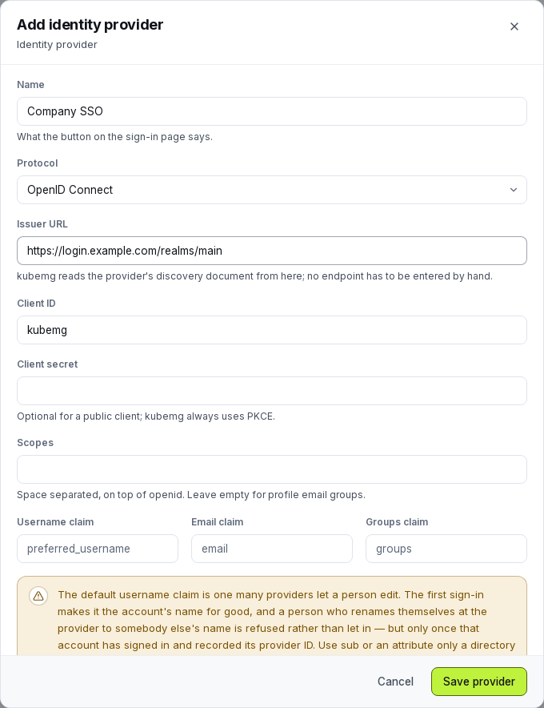

# Single sign-on

Let people sign in through your identity provider over OIDC, SAML 2.0 or LDAP, with [Okta](#okta) offered by name. Configure it at **Admin → Settings → SSO**. Local accounts keep working; what a provider's users can reach is decided by [group mappings](#group-mappings).

## Setting one up

1. Open **Admin → Settings → SSO** as an administrator.
2. Add a provider and pick its type: [Okta](#okta) (OIDC or SAML), [OIDC](#oidc), [SAML 2.0](#saml-20) or [LDAP](#ldap).
3. Register kubemg's **redirect URI** (OIDC) or **SP metadata** (SAML) with the identity provider. Both are shown on the provider's form.
4. Run **Check** on the saved provider. It performs a real read against the directory, so green means credentials and network path both work.
5. Add at least one [group mapping](#group-mappings). Until one matches, a person authenticates and lands with no cluster access.
6. Sign out and confirm the provider's button appears on the login page.

## Provider kinds

All protocols share one configuration shape; fields that do not apply stay empty.

### OIDC

Paste the issuer URL; kubemg reads its `.well-known/openid-configuration` (cached 15 minutes).

| Field | Notes |
| --- | --- |
| `issuer_url` | Required. Absolute `http(s)://` URL. |
| `client_id` | Required. |
| `client_secret` | Write-only. Omitted on update keeps the stored one; empty clears it. |
| `scopes` | Space-separated, added to `openid`. Default `profile email groups`. |
| `username_claim` / `email_claim` / `groups_claim` | Defaults `preferred_username`, `email`, `groups`. A missing claim falls back through `preferred_username → username → nickname → email → upn → sub` for the username. Prefer an identifier the person cannot edit (`sub`, or an attribute only a directory admin writes); the console warns when an editable one is configured. A username with `:` or a control character is refused on first sign-in. |
| `default_system_role` | `user` or `admin` for newly provisioned accounts, never `superadmin`. |
| `allow_jit` | Create the account on first successful sign-in. Off refuses an unrecognised username even with valid credentials. |

**Redirect URI** (register byte for byte): `{public_url}/api/v1/auth/sso/providers/{id}/callback`.

The flow is authorization code with PKCE; the ID token is verified against the issuer's keys and the nonce is checked. If the ID token has no groups, kubemg falls back to the UserInfo endpoint.

=== "Keycloak"

    Issuer URL is the realm base, e.g. `https://keycloak.example.com/realms/kubemg`. Create a confidential client with the redirect URI, add a `groups` client scope (or a mapper putting group paths into a `groups` claim), and put the secret in `client_secret`.

=== "Entra ID / Azure AD"

    Issuer URL is `https://login.microsoftonline.com/{tenant-id}/v2.0`. Register an app, add the redirect URI as a **Web** redirect, add a client secret. Entra sends group *object IDs* by default, so write mapping patterns to match whatever form it sends.

=== "Okta"

    Pick the **Okta: OpenID Connect** type; see [Okta](#okta).

=== "Google"

    Issuer URL is `https://accounts.google.com`. Google Workspace puts no groups in the ID token or UserInfo, so group rules find nothing. A mapping with pattern `*` is the practical way to grant a baseline role to every Google sign-in.

### SAML 2.0

kubemg is the service provider (SP-initiated, redirect out, POST back). It **requires signed assertions**, verified against the certificates in the IdP's metadata, and the audience must equal kubemg's entity ID. Neither check is configurable.

| Field | Notes |
| --- | --- |
| `saml_metadata_url` | Fetched fresh with a 15-minute cache. |
| `saml_metadata_xml` | A pasted document instead, for an IdP that hands out a file. One of the two is required. |
| `saml_entity_id` | What kubemg calls itself. Defaults to the metadata URL below; override only if the IdP was registered under a fixed name. |
| `username_claim` / `email_claim` / `groups_claim` | kubemg tries the configured attribute, then common friendly names (`uid`, `mail`, `Group`) and the OASIS URN names AD FS and Entra send. |

- **ACS URL:** `{public_url}/api/v1/auth/sso/providers/{id}/callback`
- **Entity ID:** `saml_entity_id`, or by default `{public_url}/api/v1/auth/sso/providers/{id}/metadata`
- **SP metadata** to upload to the IdP: `GET {public_url}/api/v1/auth/sso/providers/{id}/metadata` (unauthenticated; the provider list also shows all three).

=== "Keycloak"

    Import kubemg's SP metadata URL when adding the SAML client, or enter the ACS URL and entity ID by hand. Add a group membership mapper emitting a `Group` (or `member-of`) attribute.

=== "AD FS / Entra ID (SAML)"

    Both send long OASIS URNs by default (`http://schemas.xmlsoap.org/claims/Group`, `http://schemas.microsoft.com/ws/2008/06/identity/claims/role`). kubemg checks these even with `groups_claim` blank, but set it explicitly to your claim rule.

=== "Okta (SAML)"

    Pick the **Okta: SAML 2.0** type; see [Okta](#okta). Okta sends `Groups` when a Group Attribute Statement is configured, which kubemg already recognises. Upload the SP metadata or fill the ACS URL and entity ID.

### Okta

Okta signs in over OIDC or SAML like any provider, but is its own type (**Okta: OpenID Connect** / **Okta: SAML 2.0**) because Okta refuses requests a generic provider accepts and its addresses are easy to paste wrongly. It changes the defaults, the form hints and what is refused on save. The type is fixed once created.

In Okta, create an **OIDC: Web Application** (or **SAML 2.0**) app integration, save the provider in kubemg, then give Okta the redirect URI (or sign-on URL and audience URI) the saved provider shows.

| Issuer | Server | Groups |
| --- | --- | --- |
| `https://your-org.okta.com` | Org authorization server | Asked for with the `groups` scope; the app needs a **Groups claim filter** (for example *Matches regex* `.*`) or the claim is empty. Default scopes `profile email groups`. |
| `https://your-org.okta.com/oauth2/default` (or `/oauth2/{server id}`) | Custom authorization server | A `groups` claim (type *Groups*, in the ID token) added on the server's **Claims** tab. The server refuses the whole sign-in on an undeclared scope, so default scopes are `profile email`. |

A custom URL domain is accepted the same way.

**Refused on save**, with the field named:

- the admin console address (`your-org-admin.okta.com`); the message gives the org address to use
- an endpoint pasted where the issuer belongs (`…/oauth2/v1/authorize`)
- anything not `https`
- Okta over LDAP (add Okta's LDAP interface as a generic [LDAP](#ldap) provider)

**Check** on an Okta OIDC provider fails if a configured scope is missing from the server's advertised scopes (on a generic provider it is only a note). The username defaults to `preferred_username`; if your org lets people edit their profile, use `sub`.

### LDAP

kubemg's own login form takes a username and password and checks them against the directory; there is no redirect.

The bind order is fixed: bind as the service account (or anonymously), find the user and read groups, then bind **as the user** last. An **empty password is refused before it reaches the directory**, since a bind with a DN and no password is an unauthenticated bind most directories accept.

| Field | Notes |
| --- | --- |
| `ldap_host` / `ldap_port` | Port defaults to 636 (`ldap_use_tls`) or 389. |
| `ldap_use_tls` | Implicit TLS (`ldaps://`). Default `true`. |
| `ldap_start_tls` | Upgrade a plain connection. Both off is a cleartext bind. |
| `ldap_skip_verify` | Skips certificate verification. A standing warning in the console; for an internal CA not yet exported. |
| `ldap_bind_dn` / `ldap_bind_password` | The search account. Empty DN means anonymous; a DN without a password is refused. |
| `ldap_base_dn` | Required. Where the user search starts. |
| `ldap_user_filter` | `%s` is the escaped username. A filter without `%s` is ANDed with the username lookup, e.g. "only enabled accounts in this OU". |
| `ldap_user_attribute` | Default `uid`. |
| `ldap_email_attribute` | Default `mail`. |
| `ldap_group_attribute` | Default `memberOf`, on the user entry. |
| `ldap_group_filter` / `ldap_group_base_dn` | Fallback when membership lives on the group entry (plain OpenLDAP `groupOfNames`); `%s` is the user's DN. Used only if `ldap_group_attribute` comes back empty. |
| `ldap_group_name_attribute` | What a group is called for mapping: `cn` for a readable name, empty to match the full DN. |

Input is escaped against filter injection. A filter matching more than one entry is an error (`the user filter matched N entries; it must match one`). A filter matching none reads as invalid credentials, so the form never reveals which usernames exist.

=== "Active Directory"

    `ldap_use_tls: true` on port 636 (or `ldap_start_tls` on 389). Set `ldap_user_attribute: sAMAccountName`; the default `uid` will not match. `memberOf` reads groups off the user entry, and `ldap_group_name_attribute: cn` reduces `CN=platform-admins,OU=Groups,DC=example,DC=com` to `platform-admins`.

=== "OpenLDAP with memberOf overlay"

    With the overlay, use `ldap_group_attribute: memberOf` as for AD. Without it, leave that attribute unset, set `ldap_group_filter` such as `(&(objectClass=groupOfNames)(member=%s))`, point `ldap_group_base_dn` at the groups subtree, and use `ldap_group_name_attribute: cn`.

<figure markdown>
  
  <figcaption>Adding an OIDC provider. The issuer URL is discovered rather than configured endpoint by endpoint.</figcaption>
</figure>

## First-login provisioning

With **allow JIT provisioning** on (the default), the first successful sign-in creates the account with the provider's `default_system_role`. Off, kubemg refuses people it has not been told about, which suits installs that pre-create every account.

An existing account is matched by the directory's stable identifier first, then by username. A **local account, or one owned by another provider, with the same username is never adopted**: silently attaching a directory to an existing login would let an IdP administrator take over any account by creating a matching username. Linking is a deliberate act in the user editor. The same refusal covers a person who renamed themselves at the provider to a colleague's name.

Provisioning, group reconciliation, grant reconciliation and system role are applied in one transaction per login.

## Group mappings

A mapping rule says what one external group is worth. It can do any combination of:

1. **Put the person in a local group** (`target_group_id`), which carries whatever that group is granted in the [permission matrix](users-and-groups.md#the-permission-matrix).
2. **Grant a Kubernetes role directly** (`target_k8s_role`: `view`/`edit`/`cluster-admin`) on every cluster in an environment (`environment_filter`: `prod`/`staging`/`dev`), optionally limited to `namespaces`. Because it names an environment, not a cluster, it needs no rewriting when a cluster is registered.
3. **Set the account's system role** (`target_system_role`: `user` or `admin`, never `superadmin`). Only a rule that names a role is authoritative; if no matched rule does, the stored role stays, so a hand-promoted admin is not demoted. A super admin's role is never touched.

A rule needs at least one of the three, or it is refused at save.

### Pattern matching

`external_group_pattern` is a case-insensitive glob where `*` matches any run of characters (not a regular expression). `*` alone matches every group the provider asserted, and also someone the directory returned no groups for.

### How mappings are evaluated (the reconcile)

On every login kubemg evaluates all of the provider's rules against the asserted groups and **reconciles** what they produce:

- **Group memberships:** `sso` memberships the rules no longer produce are deleted, new ones added. Hand-added (`local`) memberships are never touched.
- **Cluster grants:** the same, on `sso` grants. Several rules for one cluster merge (stronger role wins, namespaces union). A cluster where an administrator granted access by hand (`local`) is **left alone**, so federation never undoes a deliberate decision. A **JIT elevation** is left alone too, so the federated grant beside it is not pruned and leaves the person with less access until it expires.

Deleting a provider or a rule revokes nothing by itself; what it granted unwinds at each account's next sign-in through that provider. To cut access at once, disable the account.

## Testing a provider

`POST /api/v1/admin/sso/providers/:id/check` proves the stored configuration works, so you find out here and not from the first person who cannot sign in.

- **OIDC:** re-runs discovery and confirms an authorization and a token endpoint.
- **SAML:** fetches the metadata fresh and reports the sign-on URL and signing-certificate count.
- **LDAP:** dials, performs the service bind and runs a base-DN search.

The result is stored on the provider and shown in the admin list.

## Account enumeration

A federated account has no local password. `POST /api/v1/auth/login` answers an unknown username, a wrong password, a federated account and a machine account identically (`401 invalid credentials`, with a dummy password comparison so timing matches), so probing cannot tell them apart.

The sign-in page keeps that promise: all four read *That username and password did not match*, plus (once a provider exists) a pointer to the provider's button, added to every refusal alike. A **disabled** account is the one refusal that reads as itself, because the server only says so after the password was right. An LDAP failure because the directory is unreachable says so.

## Troubleshooting

| Symptom | Cause and fix |
| --- | --- |
| SAML `the SAML assertion is expired or not yet valid` | Clock skew between the bastion and the IdP. Check NTP on both sides first. |
| Sign-in fails at the callback | The redirect URI (OIDC) or ACS URL (SAML) at the IdP must match `{public_url}/api/v1/auth/sso/providers/{id}/callback` byte for byte. If `KUBEMG_PUBLIC_URL` (or the Settings override) changes, update every provider at its IdP. |
| SAML `the SAML assertion was issued for a different service` | The entity ID kubemg sends does not match the IdP's registration. Check `saml_entity_id` (or the default metadata URL) and re-upload the SP metadata if it changed. |
| `the ID token carries no username claim` / `the SAML assertion carries no username` | The IdP sends none of the fallback names. Set the claim name explicitly or add a claim mapping at the IdP. |
| Signed in but no groups | The IdP keeps groups out of the ID token and UserInfo (Google Workspace, some default Okta/Entra setups). Change the IdP to emit the claim, or use a `*` rule for a baseline grant. |
| TLS errors to the IdP | For LDAP, `ldap_skip_verify` is the stopgap for an internal CA; turn it off once the CA is trusted. For OIDC discovery and SAML metadata, the failure shows at **Check**, so always run it after saving. |

## The REST routes

Administrative routes (admin session) are under `/api/v1/admin/sso`: `providers` (`GET`, `POST`, `PUT|DELETE /:id`, `POST /:id/check`) and `mappings` (`GET`, `POST`, `PUT|DELETE /:id`). The login page uses `/api/v1/auth/sso/providers` (list, `/:id/login`, `/:id/callback`, `/:id/metadata`). The full surface, with payloads, is in the [REST API reference](../dev/api.md#federated-sign-in-sso).
