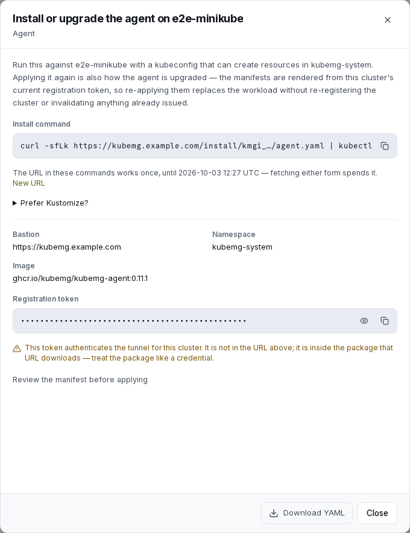

# The agent

The agent is a small open-source program that runs in a managed cluster and holds an outbound tunnel to kubemg. This page covers what it is, how to install, upgrade, rotate and remove it, and what to check when it will not attach.

For the shortest path to a first attached cluster, see the [Quickstart](../getting-started/quickstart.md).

## What it does, and deliberately does not

The agent has one job: hold the tunnel and replay whatever arrives down it against the cluster's own API server.

- It makes **no authorization decisions**. kubemg decides who may do what and asserts that identity to the cluster, so the cluster's own RBAC stays the authority.
- It installs **no CRDs** and runs **no controllers**.
- It **caches no cluster state**.
- It opens **no port to the network**, only a health endpoint on `:8081` for the kubelet's probes.

The agent is licensed under Apache-2.0 (`agent/LICENSE`), unlike the AGPL server. It is the only component that runs inside a customer's cluster, so it can be read, built from source and vendored without the server's licence reaching your infrastructure.

## What the install command fetches

The wizard's step 3, and the cluster dashboard's **Agent install** afterwards, show one of two forms:

```bash
# Publicly trusted kubemg certificate
kubectl apply -f https://your-kubemg/install/<download-ticket>/agent.yaml

# Self-signed kubemg certificate
curl -sfLk https://your-kubemg/install/<download-ticket>/agent.yaml | kubectl apply -f -
```

`kubectl apply -f` cannot carry a kubemg session, so the URL carries a **single-use download ticket**. It is not the registration token.

- A fresh ticket is minted every time the package is rendered: each opening of **Agent install**, each pass through step 3, each **New URL** click. This never changes the registration token.
- The first download spends it, for either the flat manifest or the Kustomize archive. A second fetch answers `404`. If an apply fails after the download, click **New URL** and run the new command.
- An unused ticket expires after 15 minutes. The sheet says so under the command.
- [Rotating the token](#rotating-the-registration-token) withdraws every outstanding ticket.

The downloaded YAML still contains the registration token, so treat it like a credential. A URL that ends up in shell history or a chat log is dead after the install it was made for.

!!! warning "Old install URLs no longer work"
    URLs that carried the registration token itself (`/install/kmg_…/agent.yaml`) answer `410 Gone`, valid token or not. Installed agents are unaffected. If an old URL may have leaked, [rotate the token](#rotating-the-registration-token).

Two forms are available:

- `agent.yaml`: one fully rendered manifest for `kubectl apply -f`.
- `kustomize.tar.gz`: the same content as a Kustomize package, for operators who want the files on disk first. Kustomize cannot apply a remote archive, so fetch and extract it:

  ```bash
  curl -sfL https://your-kubemg/install/<download-ticket>/kustomize.tar.gz | tar -xz
  kubectl apply -k kubemg-agent
  ```

Both are rendered from the **current** settings, so a change to the public URL or agent image in **Settings → Agent** shows up in the next command with no redeploy.

<figure markdown>
  
  <figcaption>The install sheet on a registered cluster. The apply command carries a single-use download URL, never the registration token, which stays masked until asked for.</figcaption>
</figure>

## What lands in the cluster

```
namespace/kubemg-system
serviceaccount/kubemg-agent
secret/kubemg-agent
clusterrole/clusterrolebinding × several   (see below)
deployment/kubemg-agent
```

**Namespace**: `kubemg-system` by default (`KUBEMG_AGENT_NAMESPACE`, overridable in Settings).

**Secret** `kubemg-agent` holds three keys:

| Key | Content |
|---|---|
| `bastion-url` | kubemg's public URL |
| `cluster-token` | The registration token. It authenticates the tunnel and nothing else; removing the cluster in kubemg makes it useless at once. |
| `bastion-ca` | Empty when kubemg's certificate is publicly trusted. Otherwise the PEM the agent trusts **in addition to** its system roots. |

**Deployment** `kubemg-agent`: one replica with `strategy: Recreate` (kubemg keeps only the newest tunnel per cluster, so a second replica would be displaced on every reconnect). It runs non-root (user `65532`) with a read-only root filesystem, all capabilities dropped and the `RuntimeDefault` seccomp profile. Liveness (`/healthz`) reports the process; readiness (`/readyz`) reports the tunnel, so an agent that cannot reach kubemg shows as not ready in `kubectl get pods` too.

### Resource footprint

A static binary of about 7–10 MB with a single dependency (`gorilla/websocket`), shipped on a distroless non-root image. Requests are 50m CPU and 48Mi memory; limits are 1000m CPU and 256Mi. There are no CRDs, no controller and no volume.

??? info "Why the CPU limit is generous"
    The agent relays every byte of every stream (`exec`, `logs -f`, port-forward) in 32 KB chunks. Under a lower cap a dozen concurrent streams hit CPU throttling, and that shows up as latency in every shell on the cluster, not just the busy one.

### RBAC

| Object | What it grants | Bound to |
|---|---|---|
| `kubemg-agent-impersonator` | `impersonate` on users, and on the four groups `kubemg:view`, `kubemg:edit`, `kubemg:cluster-admin`, `kubemg:users` only; `get` on `/version` | the agent's ServiceAccount |
| `kubemg-view` → built-in `view` | read-only access | group `kubemg:view` |
| `kubemg-edit` → built-in `edit` | read/write, no RBAC or quota | group `kubemg:edit` |
| `kubemg-cluster-admin` → built-in `cluster-admin` | full control | group `kubemg:cluster-admin` |
| `kubemg-crd-discovery` | `get`/`list`/`watch` on `customresourcedefinitions` | group `kubemg:users` |
| `kubemg-custom-resource-view` | `get`/`list`/`watch` on Gateway API and the five Istio API groups | group `kubemg:users` |
| `kubemg-custom-resource-edit` | `create`/`update`/`patch`/`delete`/`deletecollection` on the same groups | group `kubemg:edit` |
| `kubemg-users-discovery` → built-in `system:discovery` | lets `kubectl api-resources` resolve | group `kubemg:users` |

The agent holds almost nothing itself: its only privilege is to *impersonate*. What a caller may do is decided by these bindings and the cluster's own RBAC. Groups are named one by one, so the agent cannot claim `system:masters`, and ServiceAccounts are absent entirely. Users cannot be listed that way, so every account is impersonated as `kubemg:u:<username>`; see [Why the username is prefixed](../access/model.md#why-the-username-is-prefixed).

??? info "Why custom-resource access is enumerated, never wildcarded"
    The built-in `view`, `edit` and `cluster-admin` roles cover only the API groups Kubernetes ships. Without `kubemg-crd-discovery` Explore cannot read which CRDs exist, and without the custom-resource roles a `view` grant cannot read Gateway API or Istio objects. A wildcard `apiGroups: ["*"]` would include the core group, where Secrets live, and hand every user every secret. To let Explore browse another operator's CRDs (Strimzi, Debezium, an in-house CRD), add its API group to `kubemg-custom-resource-view` and `-edit` and re-apply.

## Environment variables

| Variable | Default | Meaning |
|---|---|---|
| `KUBEMG_BASTION_URL` | *(required)* | Public URL of the kubemg server |
| `KUBEMG_CLUSTER_TOKEN` | *(required)* | This cluster's registration token |
| `KUBEMG_KUBERNETES_URL` | `https://kubernetes.default.svc` | The cluster's own API server address |
| `KUBEMG_LISTEN_ADDR` | `:8081` | Health and readiness listener |
| `KUBEMG_INSECURE_SKIP_VERIFY` | `false` | Skip **API server** certificate verification; development only |
| `KUBEMG_BASTION_CA` | *(empty)* | PEM chain to trust for kubemg's own TLS; the manifest sets it when kubemg is self-signed or on an internal CA |
| `KUBEMG_BASTION_INSECURE_SKIP_VERIFY` | `false` | Skip **kubemg** certificate verification; development only, logs a warning |

`KUBEMG_KUBERNETES_URL`, `KUBEMG_LISTEN_ADDR` and `KUBEMG_INSECURE_SKIP_VERIFY` are also flags (`--kubernetes-url`, `--listen`, `--insecure-skip-verify`); a flag wins. To send the agent through a proxy, add the standard `HTTP_PROXY`, `HTTPS_PROXY` and `NO_PROXY` variables to the Deployment's `env`.

## Upgrading the agent image

The image is set by `KUBEMG_AGENT_IMAGE` (default `ghcr.io/kubemg/kubemg-agent:0.13.0`), overridable in **Settings → Agent** without a restart. A change affects **future** install commands; a running agent keeps its image until you re-apply.

1. Set the new image.
2. Open **the cluster's dashboard → Agent install** (admin only, agent-mode clusters). It re-renders the package from the stored token against current settings and mints a new single-use URL, nothing else. It is offered whether or not the agent is attached, since a down tunnel is when you need it.
3. Apply it with `kubectl apply -f` (or `-k`). The old pod stops before the new one starts, so the tunnel drops and reconnects. That is normal.

!!! danger "Re-apply after any kubemg upgrade that touches RBAC"
    When kubemg adds a ClusterRole the agent depends on (as it did for `kubemg-crd-discovery` and the custom-resource roles), existing installs **must re-apply their manifests**. Until then, CRD discovery answers 403 and Explore shows no custom resources, with no other symptom: the tunnel stays up and pods, services and nodes keep working. If custom-resource sections are unexpectedly empty, re-apply first.

## Rotating the registration token

The token is the agent's only credential: whoever presents it can hold the cluster's tunnel. Rotate it if it may have leaked (an old install URL in a log, a copied Secret, a departing administrator) or on a schedule.

Use **the cluster's dashboard → Rotate agent token** (admin only, agent-mode clusters; direct mode answers `409`). There is **no grace window**:

1. The new token replaces the old one, and every outstanding install URL stops working.
2. The attached agent is **disconnected immediately** (its log says `registration token rotated: re-apply the agent install package`) and reconnects with the old token are refused. On a multi-replica install, a tunnel held by another replica closes within 30 seconds.
3. The **Agent install** sheet opens with the new package. Every console session, `kubectl` call and browser shell on the cluster is down until you apply it:

   ```bash
   kubectl apply -f https://your-kubemg/install/<download-ticket>/agent.yaml
   ```

The rotation is audited as `agent-token-rotate`. Issued kubeconfigs are not affected, since they authenticate to kubemg, not to the agent.

## When a connection displaces the agent

A cluster has one tunnel and the newest connection wins. A rolling Deployment briefly runs two pods, and anybody else holding the token takes the tunnel the same way. So every takeover is recorded in the audit trail as **`agent-displaced`**, rollover or not:

| Field | What it says |
|---|---|
| Source address | Where the **new** connection came from |
| Path | The new agent's version and connection time, and the previous connection's address, version and connection time |
| Duration | How long the displaced connection had been up |

A rollover of your own Deployment usually comes from the same network, runs the same version and replaces a connection that was hours old. A new address, a different version, or a takeover seconds after a reconnect is worth a look. To be paged, create an [alarm rule](../audit/alarms.md) on the audit trail with the verb `agent-displaced`.

## Air-gapped / mirrored registries

The agent image is public at `ghcr.io/kubemg/kubemg-agent` (amd64 and arm64, no login needed). The **cluster**, not kubemg, must reach wherever it is pulled from. With no route to `ghcr.io`, mirror the image and point `KUBEMG_AGENT_IMAGE` at the mirror:

```dotenv
KUBEMG_AGENT_IMAGE=registry.internal/kubemg/kubemg-agent:0.13.0
```

If the mirror needs authentication, name a pull secret under **Agent settings → Image pull secret** (or `KUBEMG_AGENT_IMAGE_PULL_SECRET`). The manifest names it, and the install package's first step creates it from credentials in your shell; kubemg never holds them. For sites that receive images on physical media, `make save-images` writes every image an install needs into one `docker load` tarball. See [Air-gapped installs](../install/air-gapped.md).

To build the image yourself:

```bash
make agent-image AGENT_VERSION=0.13.0     # builds ghcr.io/kubemg/kubemg-agent:0.13.0 locally
make agent-image-check                    # proves the amd64+arm64 matrix builds
make agent-push AGENT_VERSION=0.13.0      # requires docker login; pushes both arches
```

`REGISTRY` in the `Makefile` (default `ghcr.io/kubemg`) is what an air-gapped site overrides to retag both kubemg images under an internal registry. Building from source and the wire protocol are in the developer guide's [The agent module](../dev/agent.md).

## Uninstalling

```bash
kubectl delete -k kubemg-agent            # if applied via the Kustomize package
kubectl delete -f agent.yaml              # if applied via the flat manifest
```

This removes the namespace, ServiceAccount, Secret, ClusterRoles, bindings and Deployment, and nothing else. The cluster's registration and history stay in kubemg until you remove the cluster from **Admin → Clusters** ([Managing a cluster](managing.md)).

## Troubleshooting: agent will not attach

The agent reconnects forever with exponential backoff (1s to 60s, jittered), so a transient failure is harmless. For a persistent one, read `kubectl -n kubemg-system logs deploy/kubemg-agent`.

=== "x509: certificate signed by unknown authority"

    The agent cannot verify kubemg's certificate. kubemg is self-signed or on an internal CA but the Secret's `bastion-ca` is empty or wrong, usually because the manifest was rendered before the certificate existed. Open **the cluster's dashboard → Agent install** and re-apply; the current CA is baked in at render time.

    If you see `bastion certificate verification is disabled; the tunnel can be intercepted`, `KUBEMG_BASTION_INSECURE_SKIP_VERIFY=true` is set on the agent. That is for hand-running against a development kubemg only.

=== "agent speaks an unsupported tunnel protocol version"

    The agent image is far out of date relative to kubemg (the protocol changes only on a breaking wire change). Re-apply the manifest with the current `KUBEMG_AGENT_IMAGE`.

=== "dial bastion: … (401 Unauthorized)" or "unknown agent registration token"

    The token does not match any cluster. Causes: it was [rotated](#rotating-the-registration-token), a stale Secret from a re-registered cluster, a typo in a hand-edited manifest, or the cluster was deleted and re-created (which mints a new token). Re-fetch the package for the current cluster and re-apply.

=== "registration token rotated: re-apply the agent install package"

    An administrator rotated the token and kubemg closed this tunnel. Apply the package **Agent install** now renders.

=== "this cluster is registered for direct API access, not for an agent"

    The token belongs to a cluster registered in **direct** mode. Re-register it in agent mode, or use direct mode's own health check.

=== "dial bastion: … (connection refused / timeout / i/o timeout)"

    The agent's pod cannot reach `KUBEMG_PUBLIC_URL`. Check:

    - A `NetworkPolicy` in `kubemg-system` blocking egress.
    - A corporate proxy in front of outbound HTTPS. Make sure `NO_PROXY` does not exclude kubemg's own host.
    - A public URL that is unreachable from *inside* the cluster (`localhost`, or an address that resolves only from your laptop). This is the most common cause; see [Quickstart](../getting-started/quickstart.md#3-give-the-bastion-an-address-your-cluster-can-reach).

### Log lines worth watching

The agent logs structured JSON to stdout.

| Line | Meaning |
|---|---|
| `"kubemg agent starting"` | Carries `version`, `namespace` and `kubernetes_url`; confirms which build and API server a pod is using. |
| `"agent handshake failed"` | kubemg rejected the hello, usually a protocol mismatch or a bad or reused token. See [Troubleshooting](../reference/troubleshooting.md). |
| `"agent stopped"` with an `error` | The process is exiting. A cancelled context is a normal shutdown and is not logged as an error. |
| `"cluster API certificate verification is disabled"` | Printed once at startup when `KUBEMG_INSECURE_SKIP_VERIFY=true`. |

On the kubemg side, a failed handshake logs `agent handshake failed  cluster=<name> error="..."` and a good one logs `agent tunnel established  cluster=<name> cluster_id=<id> agent_version=<v> kubernetes_version=<v>`.

`GET /readyz` on the agent's port answers `503 tunnel is not connected` whenever the tunnel is down. Liveness is separate on purpose: restarting the pod would not fix an unreachable kubemg, so a down tunnel must never fail liveness.
