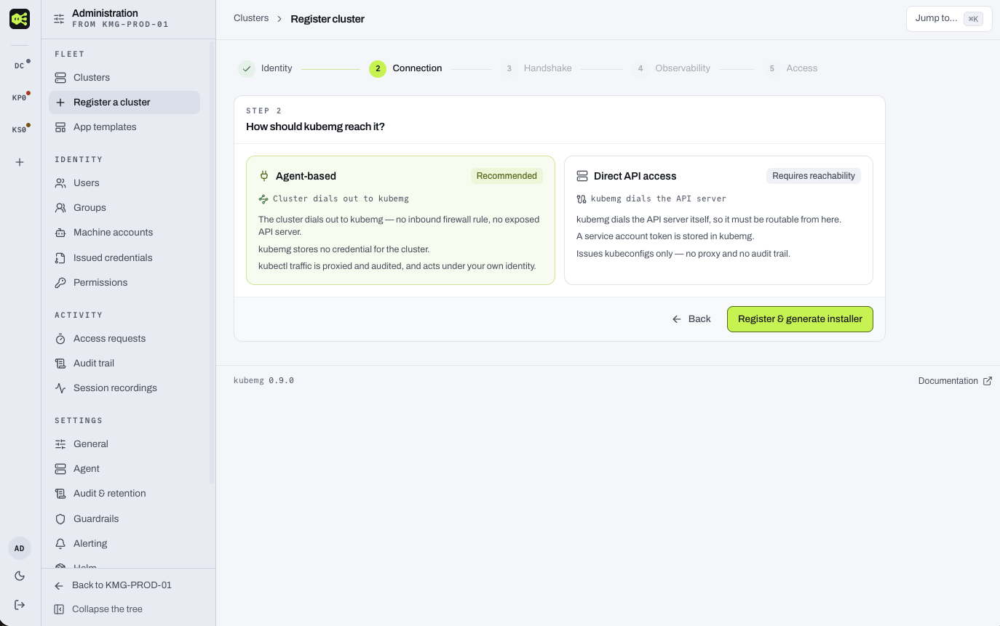

# Writing documentation

The manual is MkDocs Material in `docs/`, published at
<https://kubemg.readthedocs.io/> and versioned against the release tags.

```bash
make docs-serve   # http://localhost:8000, live reload
make docs-build   # warnings are errors — this is what runs inside make verify
```

## Which half a page belongs in

The site has two tabs and they have different readers.

| | **User guide** | **Developer guide** |
|---|---|---|
| Reader | A DevOps engineer or administrator running an install | Somebody reading or changing the source |
| Answers | "How do I add a cluster / remove a user / turn on SSO?" | "Why is it shaped like this and where do I change it?" |
| Names | Console pages, fields, buttons, settings, environment variables | Packages, files, functions, routes, tests |
| Lives in | `docs/introduction`, `getting-started`, `install`, `clusters`, `access`, `observability`, `audit`, `reference` | `docs/dev` |

The line that keeps the split honest: **a user-guide page never names a source
file, a Go package, a React component or an internal function.** If a paragraph
only makes sense to somebody with the repository open, it belongs in the
developer guide, and the user-guide page should say what the reader sees instead
and link across.

Two things are *not* implementation detail and belong in the user guide even
though they look technical: **REST routes an administrator can call** — those
link to the [REST API reference](api.md) — and **behaviour a reader would
otherwise misread**, such as a delete being marked rather than performed, or a
revoke that could not land.

## House style

- One idea per sentence. Prefer a sentence to a label with a colon.
- Say what the reader sees, then what it does, then what it refuses to do. The
  refusals are the part that saves somebody an afternoon.
- Tables for fields, settings and comparisons. Prose for arguments.
- Never state a default from memory. Read it out of the code, and link to the
  page that owns it rather than restating it — a restated default goes stale
  silently.
- Do not write version numbers into prose. The version selector at the bottom of
  the sidebar already tells the reader which release they are reading.

## Links

`mkdocs.yml` promotes a broken link and a broken anchor from informational to a
**warning**, and the strict build turns a warning into a failure. A link into a
heading that has since been renamed is the failure mode a manual actually has,
so this is deliberate: `make docs-build` fails rather than publishing a dead
anchor.

Links are relative to the page's own file, so a link from `docs/access/sso.md`
into the developer guide is `../dev/api.md`.

## Screenshots

Screenshots live in `docs/assets/screenshots/` and are referenced with a caption:

```markdown
<figure markdown>
  
  <figcaption>Step 2 chooses the connection mode. Everything after it acts on a real cluster.</figcaption>
</figure>
```

Rules that keep them worth having:

- **A screenshot supplements the words, it never carries them.** Anything a
  reader must do has to be readable with images off.
- Capture the console at a **1440-pixel-wide window**, dark deck, so the set
  looks like one product.
- No real hostnames, no real user names, no real tokens. The dev stack's seeded
  admin and a cluster called `prod-eu-west-1` are the house fixtures.
- Crop to the surface being described — a full-page capture of a sheet wastes
  most of its pixels on the page behind it.
- A screenshot of a surface that changed is worse than none. If a change moves
  a field, either recapture or delete the image in the same pull request.

A page that wants an image it does not have yet carries a placeholder rather
than a broken link, because a missing image file fails the strict build:

```markdown
!!! info "Screenshot pending — `cluster-wizard-connection.png`"
    Step 2 of the cluster wizard, with the two connection-mode cards visible.
```

### The shots this manual is waiting for

Each row is a placeholder that exists in a page today. Capture it, drop the file
in `docs/assets/screenshots/` under that name, replace the placeholder with the
figure, and delete the row.

| File | Placeholder lives in | What to capture |
|---|---|---|
| `fleet-overview.png` | `docs/introduction/overview.md` — above `## What an administrator sees` | The fleet overview signed in as an admin, three or four clusters, at least one with a down tunnel |
| `cluster-wizard-connection.png` | `docs/clusters/registering.md` — above `## Step 3 — Handshake` | Step 2 of the wizard, both connection-mode cards visible |
| `cluster-wizard-handshake.png` | `docs/clusters/registering.md` — above `## Step 4 — Observability` | Step 3 waiting for the agent, and the same step once it attaches |
| `agent-install-sheet.png` | `docs/clusters/agent.md` — above `## What lands in the cluster` | The install package sheet with the rendered apply command |
| `cluster-dashboard.png` | `docs/clusters/managing.md` — above `## Node capacity` | A healthy cluster dashboard |
| `explore-sidebar.png` | `docs/clusters/explore.md` — above `## Favorites` | The cluster tree with a discovered operator section expanded |
| `users-table.png` | `docs/access/users-and-groups.md` — above `## The access review` | The user list, with the grant editor sheet open on one account |
| `sso-provider-form.png` | `docs/access/sso.md` — above `## First-login provisioning` | An OIDC provider being configured, and the group-mapping editor |
| `kubeconfig-sheet.png` | `docs/access/kubeconfigs.md` — above `## The TTL ladder and the two ceilings` | The generate sheet with the TTL ladder open |
| `audit-trail.png` | `docs/audit/trail.md` — above `## Where a call came from` | The trail filtered to one cluster, with one record's detail sheet open |
| `recording-replay.png` | `docs/audit/session-recording.md` — above `## Where files go` | A replay mid-session |

Every one of those pages sits one directory below `docs/`, so the path in the
figure is always `../assets/screenshots/<file>`. Search the page for
`Screenshot pending` to find the exact block to replace.
