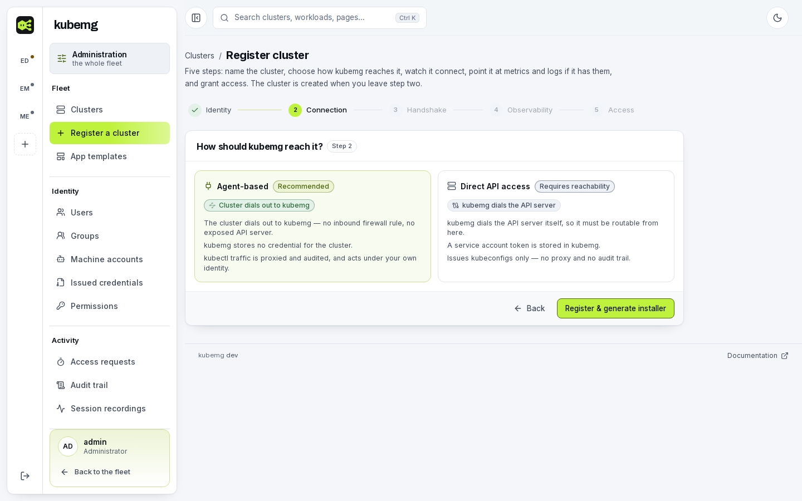

# Quickstart

Run kubemg on your laptop, attach a first cluster, and give someone access to it. This is an evaluation setup using the dev Docker Compose stack; for a real install see [Choosing a deployment](../install/index.md).

## Prerequisites

Docker and `make`. No Go, Node or npm on the host; PostgreSQL 16 comes with the stack.

## 1. Clone and bring the stack up

```bash
git clone https://github.com/kubemg/kubemg.git
cd kubemg
cp .env.example .env      # optional
make up                   # backend + frontend + PostgreSQL 16
make logs
```

| Service | Address |
|---|---|
| Console | <http://localhost:5173> |
| API / bastion | `https://localhost:8443` (self-signed certificate, minted at first boot) |
| PostgreSQL | `localhost:5432` |

!!! warning "Not for anything anyone else can reach"
    Unless `.env` sets `JWT_SECRET`, the dev stack signs sessions with a key published in this repository. If an evaluation becomes something people rely on, see [Upgrading](../install/upgrading.md).

??? info "Why TLS is on even here"
    The backend serves HTTPS on `:8443` (`KUBEMG_TLS_ENABLED=true`) because `kubectl` refuses to send a bearer token over plain `http://`. See [TLS and certificates](../install/tls.md).

## 2. Sign in

Open <http://localhost:5173> and sign in as `admin` / `admin`. The dev compose file seeds this only while the users table is empty.

!!! warning "Change it"
    On a real install leave `KUBEMG_ADMIN_PASSWORD` unset: the server generates a password and prints it once to the log. See [Production checklist](../install/production-checklist.md).

The first sign-in on a fresh database opens a one-time setup wizard: administrator password, the address clusters will dial, where the agent image comes from, what the audit trail keeps, and optionally an SSO provider. It runs once per install.

## 3. Give the bastion an address your cluster can reach

`KUBEMG_PUBLIC_URL` is baked into every agent install command, so it must be an address the **target cluster** can dial. Not `localhost`, unless the cluster runs on this machine.

=== "Local cluster (minikube/kind)"

    ```bash
    KUBEMG_PUBLIC_URL=https://host.docker.internal:8443
    ```

    On a Linux host without that alias, use the host's LAN IP.

=== "Cluster on the network"

    ```bash
    KUBEMG_PUBLIC_URL=https://192.0.2.10:8443
    KUBEMG_TLS_HOSTS=kubemg-backend,backend,192.0.2.10
    ```

    Use a reachable address: an ingress hostname, load balancer IP or NodePort address.

Optionally also set `KUBEMG_SECRET_KEY` and `KUBEMG_SESSION_RECORDING_KEY` (`openssl rand -base64 32` each). Put these in `.env`, then `make down && make up`. The public URL can also be changed at runtime in **Settings → General**; the environment variable is only the boot default.

## 4. Attach your first cluster

Open **Admin → Clusters → Register cluster**. The wizard has five steps:

1. **Identity**: name, environment (`prod`/`staging`/`dev`), optional description.
2. **Connection**: pick **Agent-based** (recommended). kubemg stores no cluster credential, only a registration token. Submitting this step creates the cluster, and steps 1-2 lock afterward.
3. **Handshake**: the install command, covered below.
4. **Observability**: optional. A cluster works with no metrics or logs backend.
5. **Access**: optionally grant a user or group a role on the new cluster.

<figure markdown>
  
  <figcaption>Step 2 chooses the connection mode.</figcaption>
</figure>

Field details are in [Adding a cluster](../clusters/registering.md).

### Run the install command

Step 3 shows a command like this. Run it with a kubeconfig context pointed at the **target** cluster:

```bash
kubectl config use-context my-target-cluster
kubectl apply -f https://your-kubemg/install/kmgi_xxxxxxxx/agent.yaml
```

Over a self-signed bastion the command is the `curl -k … | kubectl apply -f -` form instead; `-k` covers only that one download, and the agent pins the bastion's certificate automatically.

The URL carries a **single-use download ticket**: the first fetch spends it and an unused one expires after 15 minutes. If it expired, or the apply failed after the download, click **New URL** under the command.

It creates, in the cluster:

```
namespace/kubemg-system
serviceaccount/kubemg-agent
secret/kubemg-agent            # bastion URL, registration token, pinned CA
deployment/kubemg-agent        # one replica, ~7 MB, no CRDs
clusterrole/clusterrolebinding # impersonation, kubemg:view/:edit/:cluster-admin, CRD discovery
```

Every object is described in [The agent](../clusters/agent.md).

### Watch it attach

Step 3 checks the cluster every three seconds and turns green, with the agent and Kubernetes versions, when the agent connects.

<figure markdown>
  
  <figcaption>The handshake step once the agent has attached.</figcaption>
</figure>

If it does not attach within a few seconds:

- Check the pod is `Running`: `kubectl -n kubemg-system get pods`.
- Read the agent's logs for a dial failure, protocol mismatch or x509 error. See [Troubleshooting](../clusters/agent.md#troubleshooting-agent-will-not-attach).
- Confirm `KUBEMG_PUBLIC_URL` is reachable from **inside** the target cluster, not just from your laptop.

Once attached, the cluster shows a live tunnel glyph in **Operate → Fleet overview** and **Admin → Clusters**, and **Pods** opens Explore on live state. Next: [Browsing resources](../clusters/explore.md).

## 5. Give someone access

A new account can reach nothing until it holds a grant. The path is account, group, role on a cluster.

**Create the account.** In **Admin → Users** create a user with a username and password. Leave `system_role` as `user` unless this person administers kubemg itself. If a [single sign-on provider](../access/sso.md) has `allow_jit` on, skip this: the account is created at first sign-in and [group mappings](../access/sso.md#group-mappings) can do the rest.

**Put them in a group.** In **Admin → Groups** create a group and add the user. Grant a group once and every member inherits it. Membership alone confers nothing.

**Grant a role on a cluster.** In **Admin → Permissions**, grant the group (or the user, if the access is not shared) a role on one cluster:

| Field | Meaning |
|---|---|
| `k8s_role` | `view`, `edit` or `cluster-admin` |
| `namespaces` | Optional. Omit for cluster-wide access, or list namespaces to scope the grant |

```
POST /api/v1/permissions/assign
{ "subject_type": "group", "subject_id": 7, "cluster_id": 3, "k8s_role": "edit", "namespaces": ["team-a"] }
```

A scoped grant is answered from those namespaces only. A cluster-wide list (`all_namespaces=true`, or a cluster-scoped route like `clusterroles`) is refused rather than silently narrowed. Multiple grants merge into one effective grant per cluster: the more permissive role wins and namespace scopes union. See [The access model](../access/model.md) and [Effective access](../access/model.md#effective-access). For a few hours of access instead of standing access, use [just-in-time elevation](../access/jit.md).

### Verify the grant

Ask the cluster itself rather than trusting kubemg's bookkeeping. `POST /api/v1/clusters/:id/resources/access-review` runs a live `SubjectAccessReview` under the caller's own impersonated identity:

```json title="POST /api/v1/clusters/3/resources/access-review"
{ "subject": "ada", "groups": ["kubemg:edit", "kubemg:users"], "verb": "delete", "resource": "pods", "namespace": "team-a" }
```

`GET …/access-review/identity` fills in `subject` and `groups` with the exact values the proxy impersonates; `GET …/access-review/verbs` lists the verbs the form offers. A question outside the caller's own namespace scope is refused. See [Cluster RBAC visibility](../access/rbac-visibility.md).

### What they see and get

On sign-in the fleet Overview lists only the clusters the account can act on. `view` reads, `edit` also writes and deletes workloads, `cluster-admin` does everything kubemg's RBAC bindings allow. The cluster's own RBAC enforces this through impersonation; see [How a grant becomes access](../access/model.md#how-a-grant-becomes-access-on-the-wire).

To get a kubeconfig, use **Generate kubeconfig** on the cluster's page. Agent-mode files point at kubemg's proxy with a proxy-scoped token; direct-mode files carry a token minted on the cluster. See [Kubeconfigs](../access/kubeconfigs.md). For pipelines use a [machine account](../access/machine-accounts.md).

<figure markdown>
  
  <figcaption>Generating a kubeconfig from the cluster's page.</figcaption>
</figure>

### Confirm in the audit trail

Every call is recorded, including the account and permission writes, the access review and everything the user does with the kubeconfig. Filter `GET /api/v1/audit` by `user_id` or `cluster_id` to see one rollout. Non-admins see only their own rows. A `kubectl exec` shows up twice (opened, closed) and, with recording enabled, as a replay under [Session recording](../audit/session-recording.md). Edits landing in `team-a` and refusals everywhere else confirm the whole chain worked.

For anything beyond a laptop, see [Choosing a deployment](../install/index.md).
